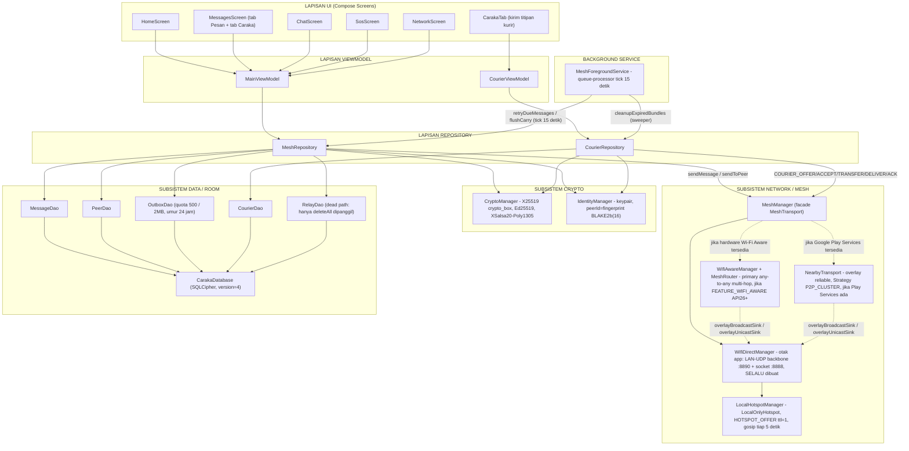
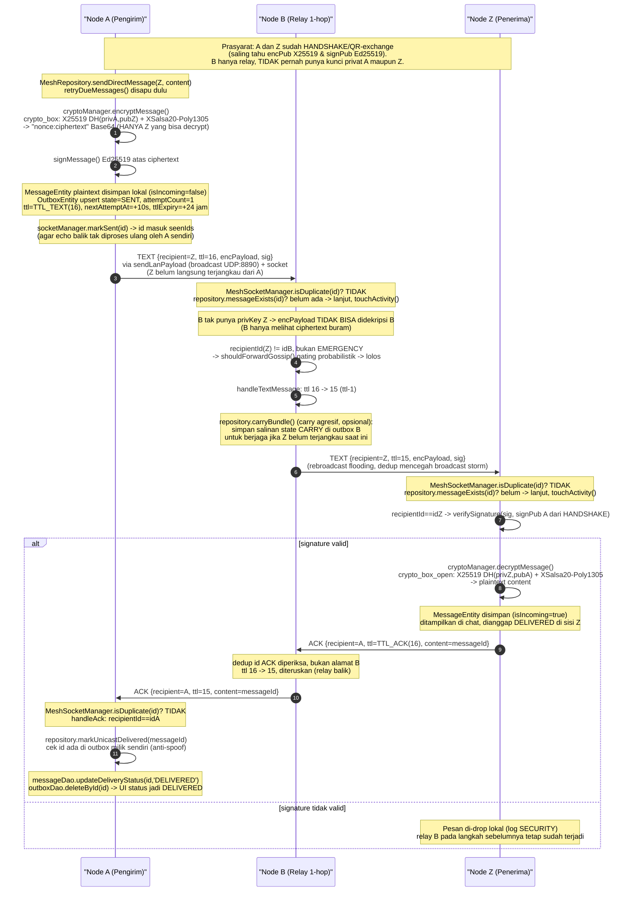
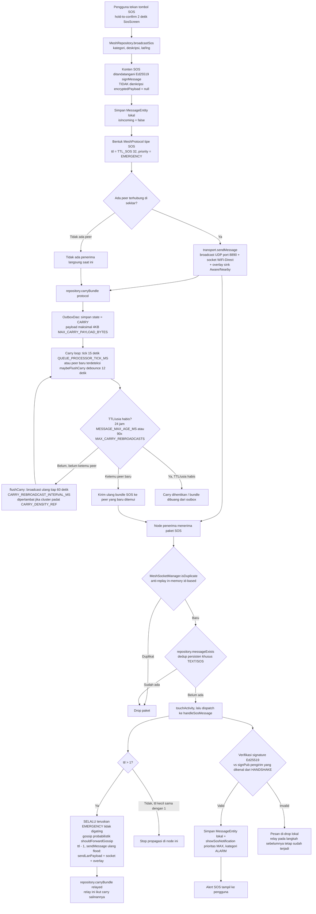
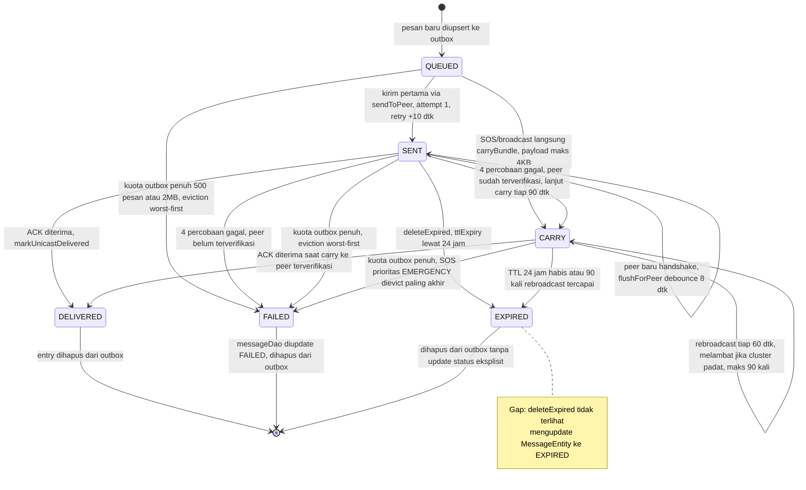
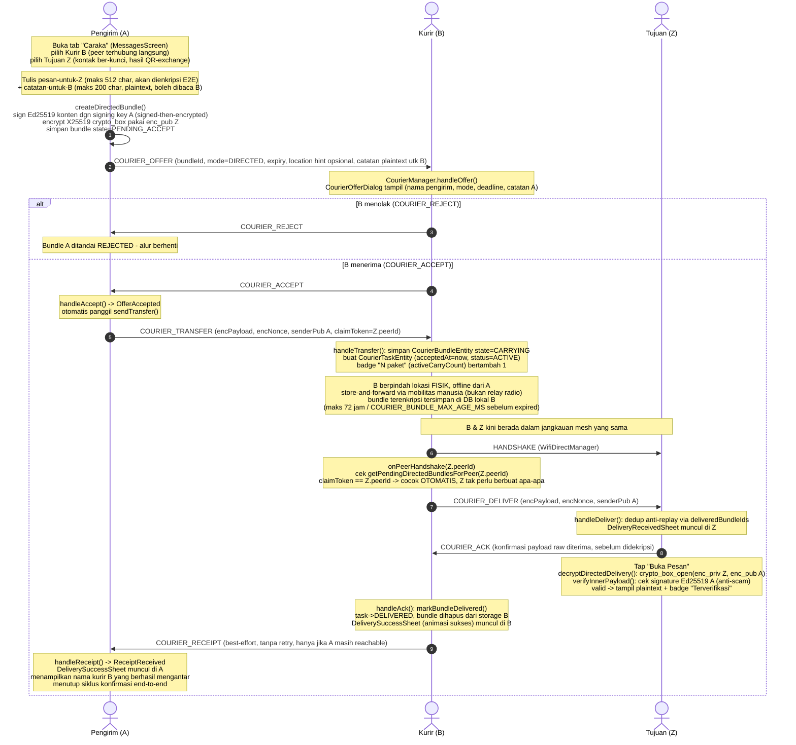
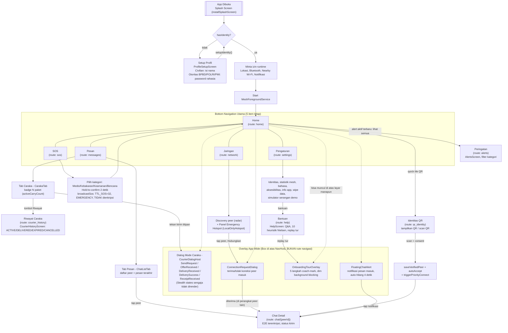

# PRD — CARAKA
### Aplikasi Pesan Mesh Darurat Offline untuk Konteks Kebencanaan Indonesia

| | |
|---|---|
| **Nama Produk** | CARAKA |
| **Versi Dokumen** | 1.0 |
| **Tanggal** | 10 Juli 2026 |
| **Status** | Disusun untuk pengembangan proposal **Wreckit 7.0** |
| **Sumber kebenaran teknis** | Hasil analisis langsung terhadap source code aktual (bukan asumsi/dokumen lama) |
| **Platform** | Android (minSdk 26 / targetSdk 36), Jetpack Compose |

---

## Daftar Isi

1. [Ringkasan Eksekutif](#1-ringkasan-eksekutif)
2. [Latar Belakang & Urgensi Masalah](#2-latar-belakang--urgensi-masalah)
3. [Tujuan Produk (Goals) & Non-Tujuan](#3-tujuan-produk-goals--non-tujuan)
4. [Pengguna Sasaran & Skenario Inti](#4-pengguna-sasaran--skenario-inti)
5. [Gambaran Fitur Utama](#5-gambaran-fitur-utama)
6. [Arsitektur Sistem](#6-arsitektur-sistem)
7. [Alur Kerja Utama](#7-alur-kerja-utama)
8. [Model Keamanan & Kepercayaan (Trust)](#8-model-keamanan--kepercayaan-trust)
9. [Model Data](#9-model-data)
10. [Persyaratan Fungsional](#10-persyaratan-fungsional)
11. [Persyaratan Non-Fungsional](#11-persyaratan-non-fungsional)
12. [Peta Navigasi UI & Design System](#12-peta-navigasi-ui--design-system)
13. [Tech Stack & Versi](#13-tech-stack--versi)
14. [Keterbatasan yang Diketahui & Risiko Teknis](#14-keterbatasan-yang-diketahui--risiko-teknis)
15. [Roadmap Pengembangan Lanjut](#15-roadmap-pengembangan-lanjut)
16. [Keunikan & Diferensiasi](#16-keunikan--diferensiasi)
17. [Dampak & Manfaat Sosial](#17-dampak--manfaat-sosial)
18. [Lampiran](#18-lampiran)

---

## 1. Ringkasan Eksekutif

**CARAKA** adalah aplikasi Android yang membentuk jaringan **mesh komunikasi lokal** antarperangkat — tanpa internet, tanpa BTS seluler, dan tanpa server pusat — yang dirancang untuk kondisi darurat kebencanaan di Indonesia. Setiap perangkat yang memasang CARAKA menjadi node dalam mesh: ia dapat menemukan perangkat lain di sekitarnya, bertukar pesan terenkripsi secara langsung, meneruskan (relay) pesan milik node lain, dan bahkan **membawa pesan secara fisik** melalui pergerakan manusia ketika tidak ada jalur radio langsung ke tujuan (mode "Caraka"/Courier).

Empat pilar teknis membedakan CARAKA dari sekadar aplikasi chat P2P biasa:

1. **Multi-transport otomatis** — LAN-UDP sebagai backbone yang selalu aktif, dilapis Wi-Fi Direct, dan secara opsional Wi-Fi Aware (bila perangkat mendukung hardware NAN) serta Google Nearby Connections (bila Play Services tersedia) — semuanya disatukan lewat satu titik pengiriman sehingga pesan otomatis mengalir ke semua jalur aktif.
2. **Store-carry-forward (DTN)** — pesan tidak hilang ketika penerima sedang di luar jangkauan; ia disimpan di outbox lokal, dicoba ulang dengan backoff, dan untuk kelas pesan tertentu (termasuk SOS) di-*carry* dan disiarkan ulang sampai bertemu peer yang relevan atau kedaluwarsa.
3. **Mode Caraka (Courier Relay)** — memecahkan kasus paling sulit di lapangan bencana: pengirim A dan tujuan Z tidak pernah berada dalam radio yang sama, tetapi ada kurir manusia B yang berpindah lokasi. Pesan dienkripsi ujung-ke-ujung, dititipkan ke B secara offline, dan otomatis diserahkan begitu B bertemu Z.
4. **Keamanan by design** — enkripsi X25519 (crypto_box, XSalsa20-Poly1305), tanda tangan Ed25519 untuk autentikasi pesan, database lokal terenkripsi SQLCipher, dan model kepercayaan Trust-On-First-Use (TOFU) berbasis pertukaran QR tatap muka.

Dokumen ini disusun berdasarkan **audit langsung terhadap source code** proyek (bukan dokumen lama yang mungkin sudah usang), dan secara sengaja menuliskan **gap serta keterbatasan yang belum terverifikasi** apa adanya — karena kredibilitas teknis lebih penting daripada tampil sempurna, khususnya untuk keperluan proposal kompetisi inovasi Wreckit 7.0.

---

## 2. Latar Belakang & Urgensi Masalah

Indonesia adalah negara dengan risiko bencana majemuk — gempa bumi, tsunami, letusan gunung berapi, banjir, dan longsor — yang berulang kali menunjukkan pola kegagalan yang sama pada infrastruktur komunikasi: menara BTS roboh atau kehilangan daya, jalur backhaul fiber terputus, dan pusat data pemerintah maupun operator seluler menjadi tidak terjangkau tepat pada momen paling kritis, yaitu 24–72 jam pertama pascabencana ketika koordinasi pencarian-dan-pertolongan (SAR) paling menentukan.

Solusi yang mengandalkan konektivitas terpusat — baik itu aplikasi pelaporan berbasis cloud, radio komunitas yang bergantung pada repeater tetap, maupun sistem informasi kebencanaan berbasis web — semuanya mewarisi titik kegagalan yang sama: begitu jaringan utama putus, seluruh sistem koordinasi digital ikut lumpuh, tepat ketika paling dibutuhkan.

CARAKA mengambil pendekatan berbeda: alih-alih bergantung pada infrastruktur yang justru paling rentan roboh saat bencana, ia menjadikan **ponsel Android yang sudah dimiliki relawan, warga, dan petugas** sebagai infrastruktur itu sendiri. Setiap perangkat menjadi node mesh yang saling menemukan lewat radio jarak pendek (Wi-Fi Direct/Aware/LAN/Nearby), sehingga komunikasi darurat tetap bisa mengalir — baik untuk permintaan tolong (SOS) maupun koordinasi taktis antar-tim — sepenuhnya lepas dari BTS, internet, dan server pusat mana pun.

Urgensi ini diperkuat oleh dua kenyataan lapangan yang menjadi fokus desain CARAKA: pertama, banyak lokasi bencana di Indonesia berjarak signifikan (belasan hingga puluhan kilometer) antara titik korban terisolasi dan posko terdekat, sehingga solusi mesh hop-tunggal (satu lompatan radio) tidak cukup — dibutuhkan mekanisme *delay/disruption-tolerant networking* yang bisa membawa pesan melintasi jarak itu lewat pergerakan manusia. Kedua, kondisi darurat sering melibatkan banyak node sekaligus (M-to-N), bukan sekadar pasangan dua perangkat — sehingga arsitektur mesh CARAKA secara eksplisit dirancang untuk skenario banyak-perangkat, termasuk kemampuan satu node menjadi hotspot darurat bagi node lain di sekitarnya.

---

## 3. Tujuan Produk (Goals) & Non-Tujuan

### 3.1 Tujuan (Goals)

- **G1 — Komunikasi tanpa infrastruktur pusat.** Pertukaran pesan teks antar-perangkat tanpa internet, tanpa akun, tanpa backend/server mana pun.
- **G2 — Jangkauan melampaui radio langsung.** Penerusan multi-hop berbasis flooding TTL, dilengkapi store-carry-forward (DTN) sehingga node yang berjarak jauh (belasan–puluhan kilometer) tetap terjangkau lewat pembawa bergerak, bukan hanya rantai hop radio kontinu.
- **G3 — Broadcast darurat (SOS) yang tidak mudah hilang.** Pesan SOS diberi prioritas tertinggi (EMERGENCY), selalu diteruskan tanpa gating gossip, dan di-*carry*/disiarkan ulang sampai TTL/usia kedaluwarsa — bukan sekali kirim yang hilang bila tidak ada peer saat itu.
- **G4 — Kerahasiaan & autentikasi pesan.** Chat langsung dienkripsi end-to-end; seluruh kelas pesan (TEXT/SOS/FLAG) ditandatangani secara kriptografis; data lokal disimpan dalam database terenkripsi.
- **G5 — Bertahan di latar belakang & hemat daya.** Berjalan sebagai foreground service dengan mekanisme duty-cycle (idle/deep-idle) untuk menekan konsumsi baterai saat mesh tidak aktif.
- **G6 — Siap pakai di lapangan.** Dwibahasa (Indonesia/Inggris), dukungan aksesibilitas (teks besar, kontras tinggi, haptic), dan onboarding bertahap agar mudah dipakai warga awam maupun petugas terlatih.
- **G7 — Komunikasi banyak-perangkat sekaligus (M-to-N).** Bukan sekadar mesh dua-perangkat berpasangan — termasuk jalur universal tanpa router/Play Services/hardware khusus lewat fitur Hotspot Darurat (LocalOnlyHotspot).
- **G8 — Mode Caraka (Courier Relay).** Menjembatani pengirim dan tujuan yang tidak pernah berada dalam radio yang sama, melalui kurir manusia yang membawa bundel pesan terenkripsi secara offline.

### 3.2 Non-Tujuan (batasan saat ini)

- Dukungan iOS atau platform lintas-OS lain — CARAKA saat ini Android-only.
- Transport non-Wi-Fi/Bluetooth seperti LoRa, radio HF, atau komunikasi satelit.
- Pesan suara/video, peta offline penuh, atau berbagi berkas besar.
- Public Key Infrastructure (PKI) tersentralisasi atau Certificate Authority (CA) online — model trust CARAKA murni TOFU berbasis QR tatap muka (lihat Bagian 8).
- Deteksi deepfake, moderasi konten otomatis, atau verifikasi identitas dunia nyata di luar pasangan kunci kriptografis.
- Sinkronisasi/backup ke cloud — CARAKA tidak mengunggah riwayat pesan ke server mana pun, bahkan saat internet tersedia kembali.
- Migrasi penyimpanan kunci privat ke Android Keystore untuk identitas pengguna — saat ini masih tersimpan di DataStore Preferences biasa (lihat Bagian 8, ditandai sebagai `TODO` eksplisit dalam kode).

---

## 4. Pengguna Sasaran & Skenario Inti

| Persona | Kebutuhan di Lapangan | Peran CARAKA |
|---|---|---|
| **Relawan SAR / Tim Tanggap Darurat** | Menemukan anggota tim lain, melaporkan kondisi lokasi, menerima instruksi taktis meski BTS mati | Discovery peer real-time, chat terenkripsi, relay multi-hop, identitas berperan (BPBD/POLRI/PMI) |
| **Korban/Warga Terisolasi** | Meminta bantuan segera tanpa sinyal seluler | Tombol SOS dengan hold-to-confirm, 4 kategori darurat, lokasi otomatis, broadcast tersiar ke seluruh mesh yang terjangkau |
| **Koordinator Posko** | Memantau status jaringan, jumlah node aktif, dan alert masuk dari berbagai titik | Dashboard HomeScreen (status mesh, jumlah node, alert terbaru), AlertsScreen dengan filter kategori, kemampuan menjadi host Hotspot Darurat untuk mempertemukan banyak node dalam satu subnet |

### Skenario Nyata

1. **Relawan SAR di reruntuhan.** Tim A dan tim B berjarak 300 meter di area reruntuhan tanpa sinyal seluler. Keduanya saling menemukan lewat radar NetworkScreen, bertukar QR identitas (TOFU, "scan = consent"), lalu berkomunikasi via chat terenkripsi E2E. Tim A menemukan korban dan mengirim laporan yang di-relay lewat TTL flooding ke tim B yang berada di luar jangkauan langsung.

2. **Korban terisolasi di titik terpencil.** Seorang warga di lokasi longsor tanpa sinyal menekan tombol SOS (hold 2 detik), memilih kategori "Bencana", CARAKA menyiarkan broadcast bertanda tangan Ed25519 (tanpa enkripsi, agar semua penyelamat bisa membacanya) dengan TTL_SOS=32 — pesan ini terus di-*carry* dan disiarkan ulang oleh setiap node yang menerimanya, sehingga bahkan tanpa peer di sekitar saat pemicu, ia akan sampai begitu ada node lain lewat dalam 24 jam ke depan.

3. **Koordinator posko yang jauh dari lokasi korban (puluhan km).** Posko utama tidak berada dalam jangkauan radio korban maupun relawan lapangan. Seorang kurir (misalnya pengendara motor logistik) yang berpindah antara lokasi korban dan posko membawa perangkatnya sendiri: relawan lapangan menitipkan pesan terenkripsi lewat mode **Caraka** kepada kurir tersebut (kurir tidak bisa membaca isi pesan), kurir berkendara ke posko, dan begitu perangkatnya melakukan handshake dengan perangkat koordinator posko, pesan otomatis diserahkan dan didekripsi — tanpa kurir maupun jaringan radio langsung menghubungkan kedua ujung.

---

## 5. Gambaran Fitur Utama

Untuk setiap fitur, status implementasi dituliskan jujur berdasarkan bukti dari source code: **Solid/Terverifikasi** (logika lengkap dan tersambung end-to-end), atau **Ada Gap** (berfungsi namun punya keterbatasan/postponed/belum diuji perangkat fisik).

### 5.1 Chat Langsung Terenkripsi (Solid)
Percakapan 1-ke-1 dengan enkripsi X25519 crypto_box (XSalsa20-Poly1305) dan tanda tangan Ed25519 di setiap pesan. Status pengiriman (SENT/QUEUED/DELIVERED/FAILED) ditampilkan real-time via `MessageStatusIcon`. ACK end-to-end memverifikasi kepemilikan sebelum menandai delivered (anti-spoof).

### 5.2 Broadcast SOS Darurat (Solid, dengan trade-off desain yang disengaja)
Empat kategori (Medis/Kebakaran/Keamanan/Bencana), hold-to-confirm 2 detik, deskripsi maksimum 280 karakter, lokasi otomatis. SOS **sengaja tidak dienkripsi** (agar semua node relay/penyelamat bisa membacanya) namun **selalu ditandatangani** Ed25519 untuk mencegah pemalsuan. Diberi TTL tertinggi (32) dan prioritas EMERGENCY yang selalu diteruskan tanpa gating gossip.

### 5.3 Relay Multi-Hop & Store-Carry-Forward (Solid untuk flooding+DTN unicast; Ada Gap untuk true routing)
Jalur LAN/Wi-Fi Direct/Nearby memakai flooding murni TTL dengan gossip probabilistik anti-storm. Store-carry-forward (outbox) menjaga pesan unicast tetap dicoba ulang dengan backoff eksponensial, dan "carry agresif" berlaku untuk semua kelas pesan termasuk SOS. **Gap:** true multi-hop routing table (distance-vector ala BATMAN/OLSR via `MeshRouter`) hanya aktif di jalur Wi-Fi Aware — mayoritas jalur (LAN/WiFiDirect/Nearby) tetap murni flooding, bukan routing table sejati.

### 5.4 Multi-Transport Otomatis (Solid untuk LAN/WiFiDirect; Ada Gap untuk overlay opsional)
`WifiDirectManager` (backbone LAN-UDP + socket) selalu aktif sebagai "otak" aplikasi. Wi-Fi Aware dan Google Nearby Connections dipasang sebagai overlay opsional. **Gap:** Wi-Fi Aware memerlukan hardware `FEATURE_WIFI_AWARE` (API26+) yang tidak tersedia di semua perangkat; Nearby Connections memerlukan Google Play Services dan silent di-skip di perangkat AOSP/de-Googled — pada perangkat semacam itu hanya tersisa Wi-Fi Direct + LAN.

### 5.5 Hotspot Darurat / LocalOnlyHotspot (Ada Gap — perlu uji multi-device)
Satu node bisa menjadi host akses poin darurat (`LocalOnlyHotspot`) dan menggosipkan kredensial ke sekitarnya, memungkinkan banyak node bergabung ke satu subnet LAN tanpa router fisik. **Gap eksplisit dari kode:** SSID/passphrase adalah pemberian framework dan bervariasi antar-OEM; satu chip Wi-Fi berarti hosting bisa menjatuhkan koneksi Wi-Fi/Direct lain yang sedang berjalan; auto-join tidak tersedia di bawah Android 10 (API 29) — perangkat lama hanya bisa melihat status, tidak bisa auto-join. Belum ada bukti pengujian lapangan multi-perangkat.

### 5.6 Mode Caraka / Courier Relay (Solid untuk alur Directed; Stealth dorman by design)
Fitur andalan untuk menjembatani pengirim dan tujuan yang tidak pernah berbagi radio yang sama, lewat kurir manusia. Alur **Directed** (state machine lengkap OFFER→ACCEPT→TRANSFER→CARRYING→handshake-trigger→DELIVER→ACK→DELIVERED→RECEIPT) terpasang penuh dari UI (tab "Caraka" di MessagesScreen) sampai wire protocol, termasuk anti-scam (signature Ed25519 dalam inner payload) dan anti-replay. **Gap:** mode **Stealth** (anonimitas kurir terhadap pengirim/penerima) fungsional penuh di backend tapi **tidak punya pintu masuk UI aktif** — keputusan produk sengaja (Directed-only untuk saat ini). Belum diuji end-to-end di perangkat fisik dengan jeda lokasi nyata. **Catatan tambahan:** UI Compose untuk Stealth sudah pernah ditulis lengkap (mode-selector di `CourierSendSheet`, `StealthBroadcastDialog`, `StealthChallengeDialog`, `StealthCredentialShareSheet` di `ui/courier/CourierComponents.kt`) namun kini menjadi *dead code* yang tidak dipanggil dari mana pun sejak migrasi ke `CarakaTab` (lihat Bagian 14, butir 18).

### 5.7 Identitas & Trust berbasis QR/TOFU (Solid, dengan batasan model trust yang diketahui)
Setiap pengguna memiliki keypair X25519 (enkripsi) + Ed25519 (signing), diidentifikasi lewat `peerId` (fingerprint BLAKE2b 16 karakter). Pertukaran kunci publik terjadi lewat scan QR tatap muka — **model Trust-On-First-Use murni**, tanpa CA/PKI. **Gap:** tidak ada revocation maupun pengecekan ulang bila kunci berubah setelah QR pertama.

### 5.8 Database Terenkripsi (Solid, dengan fallback lemah pada kasus tertentu)
Seluruh data lokal (pesan, peer, outbox, courier bundle) disimpan di database Room yang dienkripsi SQLCipher, dengan passphrase yang dilindungi AES-256-GCM via Android Keystore. **Gap:** pada perangkat di mana Keystore/TEE gagal (contoh nyata disebutkan di komentar kode: perangkat MTK dengan RKPD timeout), sistem *fallback* menyimpan passphrase hanya dalam bentuk Base64 ("obfuscated", bukan terenkripsi) di SharedPreferences biasa.

### 5.9 Navigasi, Aksesibilitas & Onboarding (Solid)
Bottom navigation 5 item (Home/Messages/Network/Sos/Settings), overlay app-wide (dialog Caraka, notifikasi chat mengambang, tur onboarding 5 langkah, dialog permintaan koneksi), dukungan teks besar/kontras tinggi/haptic, dwibahasa (Indonesia default/Inggris).

---

## 6. Arsitektur Sistem

CARAKA dibangun dengan pemisahan lapisan yang jelas: UI (Compose) → ViewModel → Repository → Network/Mesh Subsystem, dengan subsistem Crypto dan Data (Room/SQLCipher) yang dipakai bersama oleh kedua repository utama (`MeshRepository` untuk chat/SOS, `CourierRepository` untuk mode Caraka). Dependency injection dilakukan manual (tanpa Hilt/Koin) di `CarakaApp.onCreate()`, dengan urutan inisialisasi yang disengaja untuk mengatasi dependensi melingkar antara `MeshRepository` dan `MeshManager` (transport).

`MeshManager` bertindak sebagai facade: `WifiDirectManager` **selalu** dibuat sebagai backbone LAN-UDP dan fallback offline utama, sementara Wi-Fi Aware (bila hardware mendukung) dan Nearby Connections (bila Google Play Services tersedia) dipasang sebagai lapisan overlay opsional yang otomatis ikut mengirim setiap pesan lewat mekanisme `overlayBroadcastSink`/`overlayUnicastSink`.



Poin arsitektur penting yang perlu dicatat untuk penilai teknis: ada **dua mekanisme forwarding berbeda** yang berjalan berdampingan — `MeshRouter` (distance-vector ala BATMAN/OLSR dengan heartbeat 10 detik dan timeout rute 35 detik) hanya aktif di jalur Wi-Fi Aware; sedangkan jalur LAN/Wi-Fi Direct/Nearby (yang jauh lebih umum dipakai di lapangan) memakai **flooding murni** berbasis TTL yang digating gossip probabilistik, kecuali pesan EMERGENCY yang selalu diteruskan.

---

## 7. Alur Kerja Utama

### 7.1 Penemuan Peer & Handshake TOFU via QR

Sebelum dua perangkat dapat bertukar pesan terenkripsi, mereka harus saling mengenal kunci publik masing-masing. CARAKA mendukung dua jalur: koneksi manual lewat radar `NetworkScreen` (dengan dialog terima/tolak), atau jalur yang lebih cepat via **pertukaran QR** — di mana memindai kode QR pihak lain dianggap sebagai persetujuan tatap muka ("scan QR in person = consent") dan langsung memicu koneksi otomatis (`autoAccept`). Setelah handshake selesai, kedua peer saling mengenal `signPub` masing-masing sehingga pesan berikutnya (TEXT/SOS/FLAG) dapat diverifikasi tanda tangannya.

```mermaid
sequenceDiagram
    autonumber
    participant A as Perangkat A (UI)
    participant IDA as IdentityManager+QrIdentityManager (A)
    participant MMA as MeshManager+PeerDiscoverySession (A)
    participant NET as Transport Mesh (WifiDirectManager "otak", LAN-UDP :8890)
    participant MMB as MeshManager+PeerDiscoverySession (B)
    participant IDB as IdentityManager+QrIdentityManager (B)
    participant B as Perangkat B (UI)

    Note over MMA,MMB: MeshForegroundService aktif di kedua device; WifiDirectManager SELALU dibuat sbg backbone LAN-UDP (broadcast+unicast port 8890) + fallback offline

    MMA->>NET: PeerDiscoverySession.discoverPeers() tiap DISCOVERY_INTERVAL_MS=6000ms
    MMB->>NET: PeerDiscoverySession.discoverPeers() tiap DISCOVERY_INTERVAL_MS=6000ms
    NET-->>MMA: Broadcast LAN discovery port 8890 tiap LAN_DISCOVERY_INTERVAL_MS=3000ms
    NET-->>MMB: Broadcast LAN discovery port 8890 tiap LAN_DISCOVERY_INTERVAL_MS=3000ms
    Note over MMA,MMB: A & B saling terdeteksi (radar NetworkScreen) - peer belum verified, belum punya publicKey

    opt Jalur alternatif: koneksi manual tanpa QR
        B->>A: Permintaan koneksi manual (NetworkScreen -> tap "Hubungkan")
        A->>A: ConnectionRequestDialog muncul (Terima/Tolak)
    end

    Note over A,B: Jalur utama contoh: verifikasi TOFU via QR (lebih cepat, langsung verified)

    A->>IDA: Buka QrIdentityScreen
    IDA->>IDA: QrIdentityManager.buildPayload(peerId, name, role, encPub, signPub)
    IDA-->>A: Tampilkan QR identitas A

    B->>IDB: Scan QR A via CarakaQrCaptureActivity
    IDB->>IDB: QrIdentityManager.parseQrPayload(qr)
    Note right of IDB: TOFU: "Scan QR in person = consent" - tanpa CA/PKI, tanpa verifikasi tambahan
    IDB->>IDB: saveVerifiedPeer(parsed) -> simpan PeerEntity A (encPub, signPub) isVerified=true
    IDB->>MMB: requestConnectionToPeer(A.peerId, autoAccept=true) + triggerPriorityConnect

    MMB->>NET: sendToPeer/connect ke A (unicast LAN :8890 / socket WiFi-Direct)
    NET->>MMA: Permintaan koneksi masuk (autoAccept, sudah consent lewat QR)
    MMA-->>NET: Terima koneksi otomatis (tanpa ConnectionRequestDialog)

    NET->>MMA: Kirim pesan HANDSHAKE B->A (peerId, encPub X25519, signPub Ed25519)
    MMA->>IDA: Simpan/lengkapi PeerEntity B, isVerified=true (signingKey B kini dikenal)
    NET->>MMB: Kirim pesan HANDSHAKE A->B (balasan, symmetric)
    MMB->>IDB: Lengkapi PeerEntity A (kunci sudah ada dari QR, status connected)

    Note over A,B: Kedua peer kini "verified" - signature Ed25519 pada pesan berikutnya (TEXT/SOS/FLAG) diverifikasi terhadap signPub yang sudah dikenal dari QR/HANDSHAKE ini
    Note right of MMB: HANDSHAKE ini juga memicu CourierManager.onPeerHandshake(peerId) untuk cek bundle Caraka (mode kurir) tertunda bagi peer ini

    A->>B: Chat E2E (opsional lanjutan): crypto_box X25519+XSalsa20-Poly1305, signature Ed25519
    Note over NET: Overlay transport lain (Wi-Fi Aware primary bila FEATURE_WIFI_AWARE, Nearby P2P_CLUSTER bila Play Services) ikut mengirim payload sama via overlayBroadcastSink/overlayUnicastSink - disederhanakan, tidak digambar detail di sini
```

### 7.2 Pengiriman Pesan Chat Terenkripsi (dengan Relay)

Ketika penerima Z tidak berada dalam jangkauan langsung pengirim A, pesan diteruskan lewat node relay B. B tidak pernah memiliki kunci privat A maupun Z sehingga ia hanya melihat ciphertext buram — memastikan kerahasiaan tetap terjaga meski pesan melewati perangkat pihak ketiga. Konfirmasi pengiriman (ACK) mengalir kembali melalui jalur yang sama hingga status di sisi A berubah menjadi `DELIVERED`.



### 7.3 Broadcast SOS: Flooding, Gossip, dan Carry-Forward

Alur SOS dirancang dengan prinsip "tidak boleh hilang" — pesan tetap ditandatangani (bukan dienkripsi, agar semua node penyelamat bisa membacanya), selalu diteruskan tanpa gating gossip probabilistik (karena prioritas EMERGENCY), dan di-*carry* ulang oleh setiap node yang menerimanya sampai TTL/usia habis, sehingga tidak bergantung pada keberadaan peer tepat di saat tombol ditekan.



### 7.4 Siklus Hidup Pesan di Outbox DTN

Setiap pesan unicast yang belum ter-ACK melewati mesin status yang jelas: dari `QUEUED` ke `SENT` dengan retry berbatas (backoff eksponensial 10→90 detik plus jitter), lalu bercabang ke `DELIVERED` (ACK diterima), `FAILED` (percobaan habis dan peer belum terverifikasi, atau outbox penuh), `CARRY` (percobaan habis tapi peer sudah terverifikasi — dilanjutkan sebagai carry lambat), atau `EXPIRED` (TTL 24 jam lewat).



### 7.5 Mode Caraka (Courier Relay): Pengirim A – Kurir B – Tujuan Z

Inilah fitur pembeda utama CARAKA: menjembatani pengirim dan tujuan yang **tidak pernah** berbagi radio yang sama, melalui perantara manusia yang bergerak. Seluruh isi pesan dienkripsi ujung-ke-ujung sebelum meninggalkan perangkat pengirim, sehingga kurir hanya membawa "amplop tersegel" tanpa bisa membaca isinya — inti dari *disruption-tolerant networking* berbasis mobilitas manusia, bukan relay radio.



---

## 8. Model Keamanan & Kepercayaan (Trust)

**Kriptografi.** CARAKA memakai Lazysodium-Android (binding libsodium), bukan implementasi kustom. Enkripsi chat langsung memakai `crypto_box` — pertukaran kunci X25519 (Diffie-Hellman kurva eliptik) dikombinasikan dengan AEAD **XSalsa20-Poly1305** (bukan XChaCha20-Poly1305; ini dikoreksi langsung dari komentar kode sumber, sebagai pembetulan atas dokumen lama yang keliru). Autentikasi/tanda tangan memakai Ed25519 (`crypto_sign`). Identitas peer (`peerId`) adalah 16 karakter pertama dari hash BLAKE2b atas kunci publik.

**Model kepercayaan: Trust-On-First-Use (TOFU) murni.** Tidak ada Certificate Authority atau PKI tersentralisasi. Kepercayaan dibangun sepenuhnya lewat pertukaran QR tatap muka — memindai QR pihak lain dianggap sebagai bukti "consent" fisik, dan kunci publik yang dipindai langsung disimpan sebagai peer terpercaya (`saveVerifiedPeer`) tanpa lapisan verifikasi tambahan. Ini artinya keamanan CARAKA berpijak pada asumsi bahwa proses pertukaran QR terjadi secara langsung/tatap muka, bukan melalui kanal yang bisa disadap atau dipalsukan.

**SOS sengaja tidak dienkripsi.** Ini adalah keputusan desain eksplisit (bukan bug): pesan SOS harus bisa dibaca oleh siapa pun di sepanjang mesh (relay maupun tim penyelamat), sehingga enkripsi justru akan menghambat tujuan penyelamatan nyawa. Sebagai kompensasi, SOS tetap ditandatangani Ed25519 agar pemalsuan (spoofing) SOS palsu dapat dideteksi dan ditolak oleh penerima yang sudah mengenal kunci publik pengirim.

**Mode Caraka (Courier).** Dua skema kriptografis: **Directed** memakai `crypto_box` biasa dari A ke Z dengan signature Ed25519 A yang disisipkan *di dalam* payload sebelum dienkripsi (signed-then-encrypted) — kurir B tidak pernah memiliki kunci privat untuk mendekripsi maupun melihat signature. **Stealth** (backend fungsional, belum ada UI) memakai ephemeral X25519 keypair (EPK) yang kunci privatnya dikirim di luar mesh (out-of-band), dengan lapisan kedua `crypto_secretbox` — kurir B hanya memegang ciphertext dan token rendezvous (BLAKE2b-16) yang tidak bermakna tanpa nonce rahasia, sehingga B benar-benar buta terhadap isi maupun identitas kedua ujung komunikasi.

**Penyimpanan kunci — gap yang diketahui.** Kunci privat X25519/Ed25519 pengguna disimpan sebagai Base64 plaintext di Jetpack DataStore Preferences, **bukan** di Android Keystore — komentar kode sumber secara eksplisit menyatakan ini sebagai *"TODO: Migrate to Android Keystore for production security."* Identitas otoritas (BPBD/POLRI/PMI) memakai seed deterministik hardcoded yang sama di semua perangkat (`GARUDA_MESH_AUTHORITY_<role>`), yang secara eksplisit ditandai untuk keperluan demo, bukan produksi.

**Database lokal.** Room dienkripsi SQLCipher, dengan passphrase 32-byte yang dilindungi AES-256-GCM via Android Keystore. Bila Keystore/TEE gagal (kasus nyata: perangkat MTK dengan RKPD timeout), sistem *fallback* ke penyimpanan Base64 biasa tanpa enkripsi tambahan — kelemahan yang diakui secara eksplisit di komentar kode sebagai *"obfuscated"*, bukan aman secara kriptografis.

**Ringkasan batasan trust:** tidak ada revocation kunci, tidak ada pengecekan ulang bila kunci pihak lain berubah setelah QR pertama (potensi MITM pasca-first-use), dan keamanan keseluruhan bergantung pada integritas channel out-of-band (QR) serta pada perangkat yang tidak di-root/dibackup oleh pihak tidak berwenang.

---

## 9. Model Data

CARAKA memakai Room database (`CarakaDatabase`, **version = 4**, `exportSchema = false`) yang dienkripsi penuh dengan SQLCipher, berisi enam entity utama dan tiga migrasi terdaftar (1→2 menambah kolom status koneksi peer; 2→3 menambah `deliveryStatus` pada messages plus tabel outbox baru; 3→4 menambah tabel courier).

| Tabel/Entity | Tujuan | Catatan Pemakaian |
|---|---|---|
| `MessageEntity` (`messages`) | Riwayat chat & SOS, plaintext untuk ditampilkan di UI; kolom `deliveryStatus` (default `SENT`) berisi `SENT/DELIVERED/EXPIRED/FAILED` | Aktif penuh; kolom `isRelayed` tampak tidak pernah di-set true oleh kode manapun (lihat gap) |
| `PeerEntity` (`peers`) | Daftar peer yang dikenal: kunci publik, status verifikasi, koneksi, hop count | Aktif penuh |
| `OutboxEntity` (`outbox`) | Antrean DTN store-carry-forward: state, attemptCount, nextAttemptAt, ttlExpiry, replicaCount | Aktif **intensif** — jantung mekanisme retry & carry |
| `CourierBundleEntity` (`courier_bundle`) | Bundel pesan mode Caraka yang sedang dibawa kurir, state `PENDING_ACCEPT/CARRYING/...` | Aktif penuh untuk mode Caraka |
| `CourierTaskEntity` (`courier_task`) | Riwayat tugas kurir: status `ACTIVE/DELIVERED/EXPIRED/CANCELLED`, ditampilkan di `CourierHistoryScreen` | Aktif penuh |
| `RelayedMessageEntity` (`relayed_messages`) | Dimaksudkan untuk dedup anti-relay-loop | **Dead path** — hanya `deleteAll()` yang pernah dipanggil di codebase; method inti (`markAsRelayed`, `hasBeenRelayed`, `cleanOldRelays`) tidak ditemukan dipanggil di mana pun |

**Gap yang perlu dicatat:** dedup anti-replay yang sebenarnya berjalan di produksi bukan lewat `RelayDao`/`relayed_messages`, melainkan lewat kombinasi anti-replay in-memory per-komponen (`MeshSocketManager.isDuplicate`, seenIds internal `MeshRouter`) plus backstop persisten `messageExists()` khusus untuk TEXT/SOS — arsitektur dedup yang terdesentralisasi dan belum ditelusuri sepenuhnya untuk memastikan tidak ada celah. Selain itu, jalur eviksi akibat kedaluwarsa (`outboxDao.deleteExpired`) tidak terlihat memperbarui `MessageEntity.deliveryStatus` menjadi `EXPIRED` secara eksplisit, berbeda dari jalur `FAILED` yang eksplisit memanggil `updateDeliveryStatus`.

---

## 10. Persyaratan Fungsional

| ID | Nama Requirement | Deskripsi Singkat | Status |
|---|---|---|---|
| FR-01 | Chat P2P terenkripsi E2E | Percakapan 1-ke-1 dengan crypto_box X25519+XSalsa20-Poly1305, signature Ed25519, status kirim real-time | Selesai |
| FR-02 | Broadcast SOS darurat | 4 kategori, hold-to-confirm, signed-not-encrypted, TTL_SOS=32, prioritas EMERGENCY | Selesai |
| FR-03 | Relay multi-hop flooding TTL | Rebroadcast ttl-1 di jalur LAN/WiFiDirect/Nearby, digating gossip probabilistik (kecuali EMERGENCY) | Selesai |
| FR-04 | True multi-hop routing table (BATMAN/OLSR) | Distance-vector routing via `MeshRouter`, heartbeat 10 dtk, timeout rute 35 dtk | Sebagian — hanya aktif di jalur Wi-Fi Aware |
| FR-05 | Store-carry-forward DTN (unicast + broadcast) | Outbox dengan quota 500 pesan/2MB, umur maks 24 jam, carry agresif untuk semua kelas pesan | Selesai |
| FR-06 | Retry & ACK end-to-end unicast | 4 percobaan, backoff eksponensial 10→90 detik + jitter, ACK anti-spoof | Selesai |
| FR-07 | Hotspot Darurat (LocalOnlyHotspot) | Node jadi host AP darurat, gosip kredensial ttl=1 tiap 5 detik, auto-join API29+ | Sebagian — SSID/pass OEM-variable, auto-join tak tersedia <API29, belum diuji multi-device |
| FR-08 | Overlay transport Wi-Fi Aware | Primary any-to-any multi-hop bila FEATURE_WIFI_AWARE tersedia | Sebagian — bergantung hardware, tidak universal |
| FR-09 | Overlay transport Nearby Connections | Overlay reliable P2P_CLUSTER bila Google Play Services tersedia | Sebagian — silent skip di perangkat AOSP/de-Googled |
| FR-10 | Anti-storm gossip & carry density-aware | Gossip probabilistik (threshold 4, prob min 0.35), carry melambat di cluster padat | Selesai |
| FR-11 | Identitas & TOFU via QR | Pertukaran kunci publik lewat scan QR, auto-connect + auto-verified | Selesai |
| FR-12 | Enkripsi database lokal | Room + SQLCipher, passphrase dilindungi AES-256-GCM via Android Keystore | Sebagian — fallback Base64 lemah bila Keystore/TEE gagal |
| FR-13 | Mode Caraka — alur Directed | State machine lengkap OFFER→ACCEPT→TRANSFER→DELIVER→ACK→RECEIPT, signed-then-encrypted | Selesai (logika); belum diuji device fisik |
| FR-14 | Mode Caraka — alur Stealth | Ephemeral key, rendezvous token, challenge-response Ed25519, kurir buta isi & identitas | Gap — backend fungsional, tidak ada pintu masuk UI (dorman by design) |
| FR-15 | Riwayat Caraka (CourierHistoryScreen) | Daftar tugas kurir ACTIVE/DELIVERED/EXPIRED/CANCELLED | Selesai |
| FR-16 | Navigasi UI & overlay app-wide | Bottom nav 5 item, dialog Caraka/notifikasi chat/onboarding/koneksi sebagai overlay | Selesai |
| FR-17 | Aksesibilitas & i18n | Teks besar, kontras tinggi, haptic, bahasa Indonesia/Inggris | Selesai |
| FR-18 | Onboarding tour | 5 langkah coach-mark otomatis untuk pengguna baru | Selesai |
| FR-19 | Dedup/anti-replay lintas transport | Mencegah broadcast storm & pemrosesan ulang pesan yang sama | Sebagian — terdesentralisasi per-komponen; jalur `RelayDao` untuk dedup relay tampak dead path |
| FR-20 | Duty-cycle hemat baterai | Idle (>60 dtk, interval x4) dan deep-idle (>5 menit, suspend discovery) | Sebagian — deep-idle belum mematikan radio Wi-Fi sepenuhnya (postponed, menunggu kanal BLE) |
| FR-21 | Status pengiriman pesan di UI | Ikon status SENT/QUEUED/DELIVERED/FAILED di ChatScreen | Sebagian — status EXPIRED belum diupdate eksplisit ke `MessageEntity` |
| FR-22 | Penyimpanan kunci identitas | Keypair X25519/Ed25519 pengguna | Gap — disimpan plaintext Base64 di DataStore, bukan Android Keystore (TODO eksplisit di kode) |

---

## 11. Persyaratan Non-Fungsional

- **Keandalan Offline.** Seluruh fungsi inti (discovery, chat, SOS, mode Caraka) harus berjalan tanpa internet/seluler sama sekali; backbone LAN-UDP (`WifiDirectManager`) selalu aktif sebagai fallback minimum yang tidak bergantung hardware opsional.
- **Latensi & Frekuensi Operasi.** Discovery peer setiap 6 detik (`DISCOVERY_INTERVAL_MS`), broadcast discovery LAN setiap 3 detik, queue-processor outbox setiap 15 detik, heartbeat routing Wi-Fi Aware setiap 10 detik — parameter ini menyeimbangkan responsivitas mesh dengan konsumsi daya.
- **Baterai.** Duty-cycle dua tingkat: idle (>60 detik tanpa aktivitas → interval diperlambat 4x) dan deep-idle (>5 menit → discovery Wi-Fi Direct disuspend, meski listener LAN pasif tetap hidup). Foreground service + wake lock + permintaan pengecualian dari optimasi baterai OEM (Doze/MIUI/HiOS) memastikan mesh tidak dimatikan paksa oleh sistem.
- **Kapasitas & Batas Payload.** Outbox dibatasi 500 pesan/2MB total; carry payload maks 4KB; bundel Caraka maks 64KB dengan umur maks 72 jam; deskripsi SOS/body carry maks 280 karakter; frame socket dibatasi 65536 byte.
- **Keamanan.** Enkripsi E2E untuk chat (X25519+XSalsa20-Poly1305), tanda tangan Ed25519 untuk autentikasi seluruh kelas pesan, database lokal terenkripsi SQLCipher — dengan gap yang diketahui pada penyimpanan kunci identitas dan fallback Keystore (lihat Bagian 8).
- **Aksesibilitas & Bahasa.** Dukungan teks besar, kontras tinggi, umpan balik haptic, dan dwibahasa Indonesia (default)/Inggris — penting untuk penggunaan oleh warga awam dan lansia dalam kondisi darurat.
- **Skalabilitas Mesh.** Dirancang untuk skenario M-to-N (banyak node sekaligus) lewat Hotspot Darurat dan anti-storm gossip probabilistik, bukan hanya topologi dua-perangkat berpasangan — meski belum diverifikasi lewat pengujian lapangan multi-perangkat berskala besar.
- **Kompatibilitas Perangkat.** minSdk 26 (Android 8.0), targetSdk 36; fitur overlay (Wi-Fi Aware, Nearby Connections, auto-join hotspot API29+) bersifat gradual enhancement — aplikasi tetap berfungsi di perangkat tanpa fitur-fitur tersebut lewat fallback LAN/Wi-Fi Direct.

---

## 12. Peta Navigasi UI & Design System

Navigasi utama CARAKA memakai satu `NavHost` (`CarakaNav`) dengan gate identitas wajib di awal (`ProfileSetupScreen` bila `hasIdentity == false`, bukan bagian back stack). Bottom navigation dijaga tetap sederhana — hanya 5 item (Home, Messages, Network, Sos, Settings) — sementara layar sekunder (Help, QR Identity, Alerts, Courier History, Chat) diakses lewat navigasi dorong dari layar lain. Empat overlay app-wide (dialog Mode Caraka, notifikasi chat mengambang, tur onboarding, dialog permintaan koneksi) dirender di atas `NavHost` lewat `Box`+`CompositionLocal`, sehingga bisa muncul di layar mana pun tanpa menjadi rute navigasi tersendiri.



**Design system.** UI dibangun sepenuhnya dengan Jetpack Compose. Preferensi UI (`UiPreferences` via DataStore) menyimpan `bigText`, `highContrast`, `haptics`, `language` (default Indonesia), dan `onboardingDone` secara persisten, semuanya diekspos lewat `LocalUiPrefs` dan dikonsumsi `CarakaTheme(highContrast, bigText)`. Elemen interaktif secara konsisten diberi `Modifier.semantics{contentDescription=...}` untuk mendukung pembaca layar. Detail lengkap skema warna (light/dark) tidak termasuk cakupan verifikasi kode pada dokumen ini karena file `Theme.kt`/`StatusColors.kt` berada di luar bahan yang diaudit — catatan proyek internal menyebutkan token bergaya GitHub-dark yang belum diaktifkan penuh untuk dark mode.

---

## 13. Tech Stack & Versi

| Komponen | Versi/Detail |
|---|---|
| Bahasa | Kotlin 2.0.21 |
| Build Tool | Android Gradle Plugin (AGP) 8.13.2 |
| UI Framework | Jetpack Compose (BOM 2024.09.00), plugin `org.jetbrains.kotlin.plugin.compose` (compiler menyatu dengan versi Kotlin, tanpa nomor versi compiler terpisah) |
| compileSdk / targetSdk | 36 |
| minSdk | 26 (Android 8.0) |
| Versi Aplikasi | versionCode 1, versionName "1.0" |
| Java Compatibility | JavaVersion 11 |
| Database | Room 2.6.1 + SQLCipher 4.5.4 |
| Kriptografi | Lazysodium-Android 5.1.0 (binding libsodium), JNA 5.14.0 |
| QR Code | ZXing (embedded) 4.3.0, zxing-core 3.5.3 |
| Serialisasi | Gson 2.11.0, kotlinx-serialization 1.7.3 |
| Konkurensi | Kotlinx Coroutines 1.9.0 |
| Navigasi | Navigation Compose 2.8.4 |
| Lifecycle | Lifecycle 2.8.7, Activity Compose 1.9.3 |
| Google Nearby Connections | com.google.android.gms:play-services-nearby:19.3.0 (hardcoded di `build.gradle.kts`, di luar version catalog) |
| Annotation Processing | KSP plugin 2.0.21-1.0.27 |
| Dependency Injection | Manual (tanpa Hilt/Koin) — dirakit langsung di `CarakaApp.onCreate()` |
| Lain-lain | Core KTX 1.15.0, Core SplashScreen 1.0.1, DataStore Preferences 1.1.1, Google Fonts 1.7.5 |

**Izin Android kunci (AndroidManifest.xml):** `ACCESS_WIFI_STATE`/`CHANGE_WIFI_STATE`/`CHANGE_WIFI_MULTICAST_STATE` (Wi-Fi Direct), `ACCESS_FINE_LOCATION`/`ACCESS_COARSE_LOCATION` (wajib untuk discovery Wi-Fi Direct di Android 8+), `NEARBY_WIFI_DEVICES` (Android 13+, flag `neverForLocation`), Bluetooth klasik (maxSdk 30) dan Bluetooth baru (ADVERTISE/CONNECT/SCAN untuk Android 12+ guna Nearby Connections), `FOREGROUND_SERVICE` + `FOREGROUND_SERVICE_CONNECTED_DEVICE`, `WAKE_LOCK`, `REQUEST_IGNORE_BATTERY_OPTIMIZATIONS`, serta `CAMERA` untuk pemindaian QR.

---

## 14. Keterbatasan yang Diketahui & Risiko Teknis

Bagian ini secara sengaja mencantumkan seluruh gap yang teridentifikasi dari audit kode, tanpa ditutup-tutupi:

1. **Routing multi-hop sejati hanya di Wi-Fi Aware.** `MeshRouter` (distance-vector ala BATMAN/OLSR) tidak aktif di jalur LAN/Wi-Fi Direct/Nearby yang jauh lebih umum dipakai — jalur tersebut tetap flooding TTL murni, bukan routing table.
2. **Carry untuk penerima tak terverifikasi ditunda.** Komentar eksplisit di `MeshRouter.kt`: *"general stranger-carry remains POSTPONED (D8)"* — carry di luar kontak terpercaya sengaja belum didukung.
3. **Deep-idle belum menghemat daya maksimal.** Komentar eksplisit: mematikan radio Wi-Fi sepenuhnya menunggu kanal presence hemat daya (BLE), yang **POSTPONED (D15)** — saat ini deep-idle hanya mensuspend active discovery.
4. **Hotspot Darurat belum diuji lapangan multi-perangkat.** Caveats eksplisit di kode: SSID/passphrase pemberian framework yang bervariasi antar-OEM, satu chip Wi-Fi berarti hosting bisa menjatuhkan koneksi lain yang sedang berjalan, dan auto-join tidak tersedia di bawah Android 10 (API 29).
5. **Overlay transport tidak universal.** Nearby Connections memerlukan Google Play Services (silent skip di perangkat AOSP/de-Googled); Wi-Fi Aware memerlukan hardware `FEATURE_WIFI_AWARE` yang tidak tersedia di semua perangkat.
6. **Status EXPIRED tidak diupdate eksplisit ke `MessageEntity`.** Jalur `outboxDao.deleteExpired` menghapus entry outbox tanpa memperbarui `deliveryStatus` menjadi `EXPIRED`, berbeda dari jalur `FAILED`.
7. **Dedup/anti-replay terdesentralisasi.** Anti-replay id-based diimplementasikan terpisah per komponen (`MeshSocketManager` Wi-Fi Direct, `MeshSocketManager` Aware terpisah, seenIds internal `MeshRouter`); `RelayDao`/`relayed_messages` yang dimaksudkan sebagai mekanisme dedup relay tampak sebagai dead path (hanya `deleteAll()` yang dipanggil).
8. **Penyimpanan kunci identitas belum di Keystore.** Kunci privat X25519/Ed25519 pengguna disimpan Base64 plaintext di DataStore — `TODO` eksplisit di kode untuk migrasi ke Android Keystore.
9. **Identitas otoritas memakai seed hardcoded.** Seed deterministik yang sama di semua perangkat untuk peran BPBD/POLRI/PMI — ditandai eksplisit untuk demo, bukan produksi; siapa pun yang tahu seed dapat memalsukan identitas otoritas.
10. **Fallback Keystore lemah.** Bila TEE/Keystore gagal (kasus nyata: device MTK dengan RKPD timeout), passphrase database disimpan hanya di-Base64 (obfuscated, bukan terenkripsi) di SharedPreferences.
11. **Model TOFU tanpa revocation.** Tidak ada mekanisme pencabutan kepercayaan atau deteksi perubahan kunci pasca-QR pertama.
12. **SOS terbuka untuk siapa pun yang mendengarkan mesh.** Trade-off desain yang disengaja, namun berarti isi dan lokasi SOS tidak rahasia terhadap pihak ketiga di sepanjang jalur mesh.
13. **Mode Stealth (Caraka) dorman di UI.** Backend fungsional penuh tapi tidak ada pintu masuk pengguna — keputusan produk yang disengaja, bukan bug, tapi berarti kapabilitas anonimitas kurir saat ini tidak dapat diakses pengguna.
14. **Potensi bug pemisah kontak manual.** `UiPreferences.manualSep = ""` (separator kosong) menggabungkan `peerId` dan nama tanpa delimiter — secara logis berpotensi membuat parsing `split(manualSep, limit=2)` tidak deterministik; belum diverifikasi lewat pengujian manual di perangkat.
15. **Belum ada pengujian perangkat fisik multi-device** untuk: alur Caraka penuh A→B→Z dengan jeda lokasi nyata, badge carry count real-time multi-bundle, sweeper `cleanupExpiredBundles` pada bundel yang benar-benar melewati 72 jam, dan performa Hotspot Darurat pada kondisi lapangan sesungguhnya.
16. **Receipt kurir best-effort tanpa retry.** Bila pengirim A offline saat kurir B mengirim `COURIER_RECEIPT`, A tidak akan pernah menerima konfirmasi meski pesan sudah delivered sempurna ke Z.
17. **Rebranding UI belum menyentuh penamaan internal.** Migrasi istilah "Kurir/Courier" ke "Caraka" baru pada lapisan UI-facing; nama class/file/DAO/tabel (`CourierManager`, `courier_bundle`, dll.) masih memakai istilah lama.
18. **Kode UI Stealth tersisa sebagai dead code, bukan sekadar "belum dibuat".** Selain tidak adanya pintu masuk UI aktif (lihat butir 13), Compose UI untuk mode Stealth ternyata sudah pernah ditulis lengkap — mode-selector STEALTH di `CourierSendSheet`, `StealthBroadcastDialog`, `StealthChallengeDialog`, dan `StealthCredentialShareSheet` (semua di `ui/courier/CourierComponents.kt`) — namun kini orphaned: tidak dipanggil dari file manapun sejak `CourierScreen.kt` digantikan `CarakaTab.kt` (`CarakaSendSheet` di `ui/courier/CarakaTab.kt` hardcode `mode="DIRECTED"` tanpa mode selector). Setara dengan dead path `RelayDao` (lihat butir 7) — sebaiknya dihapus atau didaftarkan sebagai item cleanup eksplisit di roadmap.

---

## 15. Roadmap Pengembangan Lanjut

### Jangka Pendek (0–3 bulan, prioritas kompetisi/demo)
- Uji lapangan multi-device (minimal 3 perangkat) untuk memvalidasi Hotspot Darurat, alur Caraka penuh, dan carry count real-time.
- Perbaiki/verifikasi bug potensial separator kontak manual (`UiPreferences.manualSep`).
- Tambahkan update status `EXPIRED` eksplisit ke `MessageEntity` pada jalur `deleteExpired`.
- Migrasi penyimpanan kunci identitas pengguna ke Android Keystore (menutup TODO yang sudah tercatat di kode).
- Dokumentasikan dan uji ulang mekanisme dedup anti-replay lintas transport secara menyeluruh (konsolidasi atau hapus `RelayDao` yang dead path).
- Bersihkan kode UI Stealth yang orphaned (`CourierSendSheet` mode-selector, `StealthBroadcastDialog`, `StealthChallengeDialog`, `StealthCredentialShareSheet` di `CourierComponents.kt`) — hapus bila Stealth tidak jadi direaktivasi jangka pendek, atau sambungkan kembali ke `CarakaTab` bila reaktivasi (lihat Jangka Menengah) dipilih.

### Jangka Menengah (3–9 bulan)
- Perluas `MeshRouter` (routing table sejati) ke jalur LAN/Wi-Fi Direct, tidak hanya Wi-Fi Aware, untuk multi-hop yang lebih efisien di jalur paling umum dipakai.
- Evaluasi reaktivasi mode Stealth di UI (bila kebutuhan anonimitas kurir tervalidasi oleh pengguna nyata di lapangan).
- Implementasi kanal presence hemat daya (BLE) untuk deep-idle sejati, menuntaskan item yang di-postpone (D15).
- Selesaikan rebranding penamaan internal kode dari "Courier" ke "Caraka" secara konsisten.

### Jangka Panjang (9+ bulan)
- Eksplorasi dukungan carry untuk penerima yang belum terverifikasi (stranger-carry, D8) dengan mitigasi risiko spam/abuse.
- Kajian PKI ringan/desentralisasi sebagai pelengkap TOFU (mis. web-of-trust) untuk mengurangi risiko MITM pasca-QR pertama.
- Evaluasi transport tambahan yang lebih tahan jarak jauh dan tidak bergantung hardware opsional (mis. BLE mesh sebagai kanal cadangan berdaya rendah).

---

## 16. Keunikan & Diferensiasi

Dibandingkan aplikasi mesh messaging sejenis (mis. Bridgefy dan aplikasi offline-mesh lain), CARAKA menonjolkan kombinasi karakteristik berikut — **hanya klaim yang didukung langsung oleh bukti kode di atas**:

- **Multi-transport tersatukan secara otomatis dalam satu titik pengiriman.** LAN-UDP, Wi-Fi Direct, Wi-Fi Aware, dan Google Nearby Connections semuanya terhubung lewat mekanisme `overlayBroadcastSink`/`overlayUnicastSink`, sehingga satu panggilan `sendMessage`/`sendToPeer` otomatis mengalir ke semua jalur aktif tanpa duplikasi berkat anti-replay id-based — bukan sekadar satu jalur tunggal.
- **Store-carry-forward yang benar-benar agresif untuk SEMUA kelas pesan, termasuk SOS.** Broadcast darurat tidak hilang begitu saja bila tidak ada peer saat dipicu; ia disimpan, disiarkan ulang hingga 90 kali dalam jendela 24 jam, dan diprioritaskan paling akhir saat terjadi eviction kuota.
- **Mode Caraka (Courier Relay) sebagai jawaban untuk jarak jauh tanpa infrastruktur.** Bukan sekadar mesh hop-radio, tapi *disruption-tolerant networking* berbasis mobilitas manusia — pengirim dan tujuan tidak perlu pernah berada dalam radio yang sama, dengan jaminan kriptografis signed-then-encrypted sehingga kurir manusia tidak pernah bisa membaca isi titipan.
- **Hotspot Darurat sebagai enabler M-to-N universal.** Satu node dapat menjadi titik pertemuan banyak node sekaligus tanpa router fisik, Google Play Services, ataupun hardware Wi-Fi Aware — menurunkan hambatan skala mesh ke perangkat paling umum dimiliki.
- **Kejujuran teknis sebagai bagian dari desain.** Trade-off keamanan (SOS tidak dienkripsi demi keterbacaan penyelamat) dan gap implementasi (routing terbatas di Wi-Fi Aware, penyimpanan kunci belum di Keystore) didokumentasikan secara eksplisit dalam kode itu sendiri — mencerminkan proses rekayasa yang transparan dan siap diaudit, bukan produk "black box".

---

## 17. Dampak & Manfaat Sosial

CARAKA menjawab kesenjangan struktural dalam manajemen bencana Indonesia: ketergantungan berlebihan pada infrastruktur telekomunikasi terpusat yang justru paling rentan roboh tepat pada jam-jam emas pascabencana. Dengan menjadikan ponsel Android yang sudah dimiliki relawan, petugas, dan warga sebagai simpul jaringan darurat, CARAKA berpotensi:

- **Mempercepat respons SAR** lewat broadcast SOS yang tidak bergantung keberadaan peer saat kejadian (carry-forward hingga 24 jam), memperbesar peluang permintaan tolong sampai ke penyelamat meski awalnya tidak ada siapa pun dalam jangkauan.
- **Menjangkau korban yang terisolasi secara geografis** (belasan-puluhan kilometer dari posko) lewat mode Caraka, tanpa memerlukan infrastruktur relay radio kontinu — cukup mengandalkan pergerakan manusia yang memang sudah terjadi secara alami di lapangan (kurir logistik, relawan berpindah, dsb).
- **Mendukung koordinasi multi-tim tanpa titik kegagalan tunggal** — setiap node independen, tidak ada server pusat yang bisa jadi target gangguan (baik akibat bencana alam maupun ancaman siber, relevan dengan tema Wreckit 7.0).
- **Menekan biaya implementasi** karena tidak memerlukan perangkat keras khusus (radio HT, repeater, satelit) — cukup ponsel Android kelas menengah yang sudah beredar luas (minSdk 26/Android 8.0), menjadikannya solusi yang realistis diadopsi cepat oleh komunitas rawan bencana dan organisasi relawan dengan anggaran terbatas.
- **Menjaga kedaulatan data darurat** — seluruh komunikasi dan penyimpanan bersifat lokal-first, tidak pernah diunggah ke cloud pihak ketiga mana pun, relevan untuk skenario di mana kepercayaan terhadap infrastruktur digital terpusat sedang terganggu (baik oleh bencana alam maupun insiden siber).

---

## 18. Lampiran

### 18.1 Dokumen Referensi Lain di Repositori (untuk pendalaman lebih lanjut)

- `PRD.md` — PRD teknis versi sebelumnya (v4.0), berisi detail engineering lebih rinci per fase pengembangan backend.
- `README.md` — narasi produk, nilai bisnis, dan panduan mulai cepat untuk kontributor.
- `docs/RESEARCH_ARSITEKTUR_CARAKA.md` — riset perbandingan arsitektur transport & DTN yang mendasari keputusan desain mesh CARAKA.
- `docs/architecture/caraka-architecture-baseline.md` — baseline arsitektur teknis untuk referensi implementasi.
- `caraka_mode_plan_caraka.md` — rencana kerja rebranding UI Courier→Caraka dan relokasi tab dalam MessagesScreen (working document, mencerminkan pekerjaan yang sedang berjalan pada saat dokumen ini disusun).

### 18.2 Catatan Metodologi Penyusunan Dokumen

Seluruh klaim teknis, nama algoritma, versi library, konstanta (TTL/kuota/interval), nama tabel database, dan status fitur pada dokumen ini bersumber langsung dari audit source code CARAKA yang telah diverifikasi, bukan dari asumsi atau ekstrapolasi. Gap dan keterbatasan dituliskan secara eksplisit sesuai temuan audit — termasuk hal-hal yang belum diuji di perangkat fisik — sebagai bagian dari komitmen transparansi teknis dokumen ini untuk mendukung evaluasi proposal Wreckit 7.0 secara jujur dan dapat dipertanggungjawabkan.
