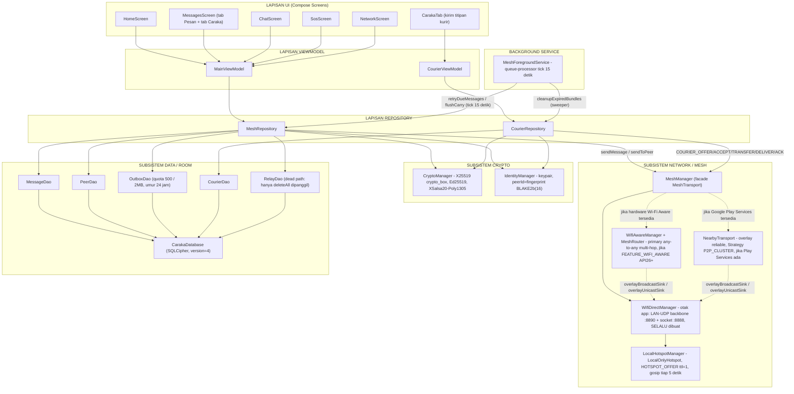
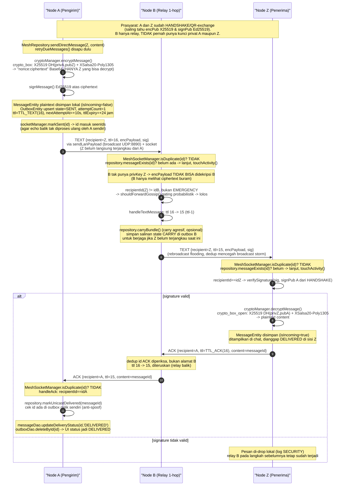
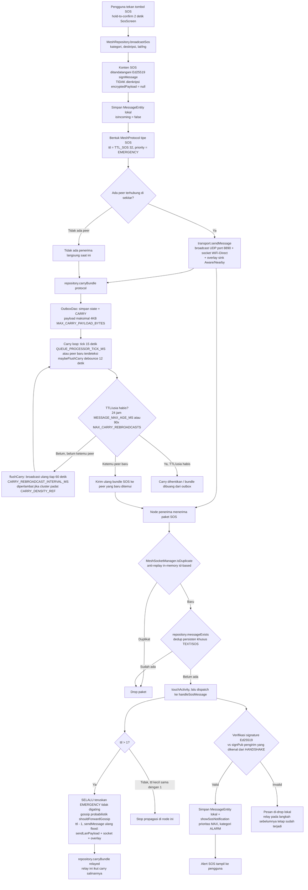
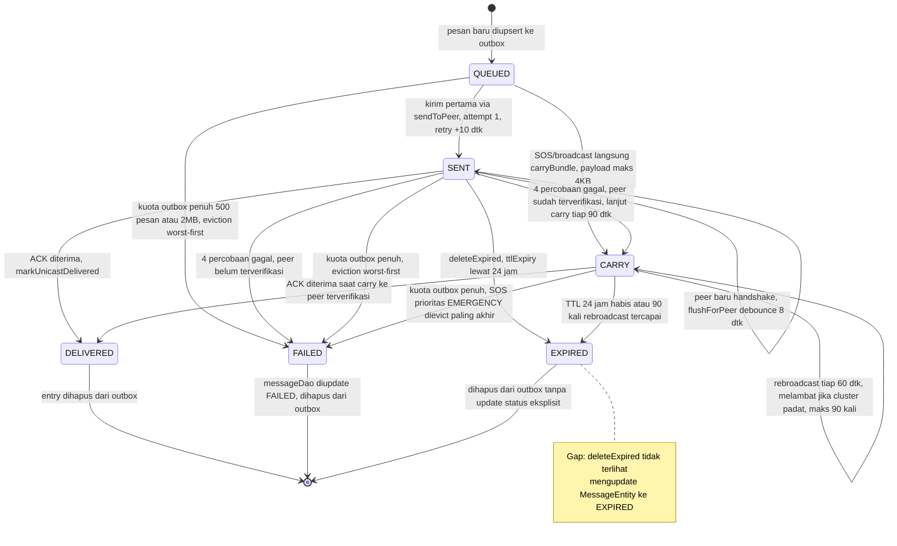
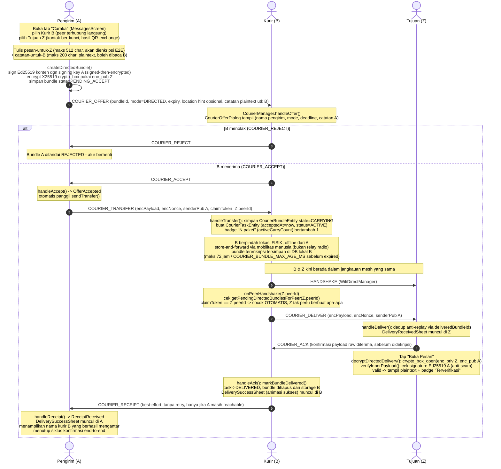
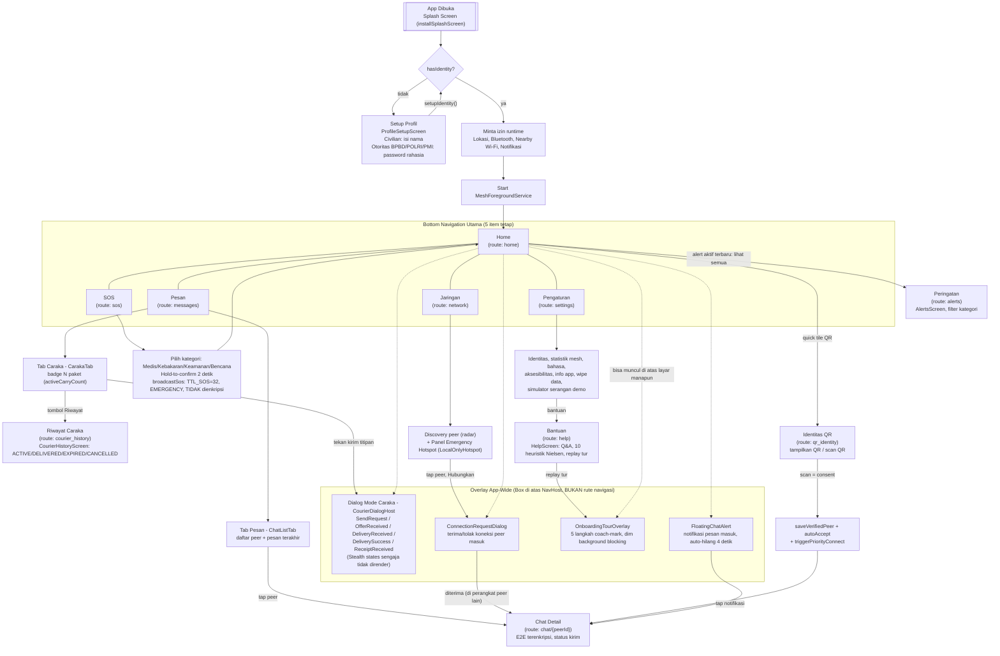

# CARAKA

## Ketika Radio Dibungkam, Manusia Tetap Mengantar Pesan

**Mesh Communication Darurat Offline dengan Disruption-Tolerant Courier Relay — untuk Ketahanan Komunikasi Indonesia di Domain Kelima**

| | |
|---|---|
| **Nama Produk** | CARAKA |
| **Kompetisi** | Hackathon **WRECK-IT 7.0** — Senat Korps Taruna Politeknik Siber dan Sandi Negara |
| **Tema Resmi** | *"Cyber Warfare: Silent War on The Fifth Domain"* |
| **Jenis Dokumen** | Draf Proposal — untuk dikembangkan tim menjadi dokumen submission resmi (proposal + video + repositori GitHub) |
| **Status Dokumen** | v0.1 — disusun berdasarkan audit langsung terhadap source code aktual (lihat `PRD_WRECKIT7.md`) |
| **Tim** | [Nama Tim — TBD] |
| **Anggota** | [Nama 1 — TBD], [Nama 2 — TBD], [Nama 3 — TBD], [Nama 4 — TBD], [Nama 5 — TBD] |
| **Repositori** | [tautan GitHub — TBD] |
| **Tanggal Penyusunan** | 10 Juli 2026 |

> CARAKA adalah aplikasi Android yang mengubah ponsel yang sudah dimiliki relawan, petugas, dan warga menjadi simpul jaringan komunikasi darurat — tanpa internet, tanpa BTS, tanpa server pusat. Yang membedakannya dari aplikasi *mesh chat* sejenis bukan hanya jangkauan radio, melainkan **Mode Caraka**: kemampuan menitipkan pesan terenkripsi ujung-ke-ujung kepada kurir manusia yang bergerak, sehingga pengirim dan tujuan tidak pernah perlu berada dalam jangkauan radio yang sama. Ketika domain kelima diserang dan setiap gelombang radio bisa di-*jamming*, pergerakan manusia — kurir logistik, relawan berpindah, siapa pun yang berjalan dari titik A ke titik Z — menjadi jalur komunikasi yang secara harfiah tidak bisa diretas.

---

## DAFTAR ISI

1. BAB I — Pendahuluan
   1.1 Latar Belakang · 1.2 Rumusan Masalah · 1.3 Tujuan · 1.4 Manfaat · 1.5 Ruang Lingkup
2. BAB II — Tinjauan Pustaka
   2.1 Cyber Warfare dan Domain Kelima · 2.2 Zero Trust Architecture · 2.3 Mesh Networking dan DTN · 2.4 Kriptografi Tanpa Otoritas Pusat
3. BAB III — Metodologi
   3.1 Arsitektur Sistem · 3.2 Tech Stack · 3.3 Protokol & Alur Kerja Utama · 3.4 Model Keamanan
4. BAB IV — Pembahasan
   4.1 Deskripsi Solusi · 4.2 Fitur Utama · 4.3 Inovasi & Diferensiasi (Mode Caraka) · 4.4 Studi Kasus/Skenario · 4.5 Evaluasi HCI/UX · 4.6 Dampak · 4.7 Kelebihan & Keterbatasan
5. BAB V — Penutup
   5.1 Kesimpulan · 5.2 Saran Pengembangan Lanjut
6. Daftar Pustaka
7. Lampiran
   Lampiran A (Pemetaan Kriteria Penilaian) · Lampiran B (Rencana Demo) · Lampiran C (Peta Navigasi UI) · Lampiran D (Dokumen Pendukung) · Catatan Penilaian Internal

*Catatan produksi: diagram pada draf ini ditulis dalam sintaks Mermaid untuk memudahkan revisi kolaboratif tim. Sebelum submission resmi (PDF/Word), seluruh diagram akan dirender ulang menjadi gambar statis (PNG/SVG) dan disisipkan langsung ke dokumen, agar tampilannya konsisten terlepas dari dukungan Mermaid pada platform pembaca akhir.*

---

# BAB I — PENDAHULUAN

## 1.1 Latar Belakang

Domain siber (*cyberspace*) telah diakui sebagai medan pertempuran kelima (*fifth domain*) setelah darat, laut, udara, dan ruang angkasa. Berbeda dari empat domain sebelumnya, serangan di domain kelima kerap bersifat senyap (*silent*) — tidak ada ledakan yang terlihat, namun dampaknya bisa melumpuhkan seluruh rantai komando dan koordinasi sebuah bangsa dalam hitungan jam. Badan Siber dan Sandi Negara (BSSN) mencatat lebih dari 400 juta anomali trafik siber terjadi di Indonesia sepanjang 2023, dengan sektor infrastruktur kritis — termasuk telekomunikasi — sebagai salah satu target utama (BSSN, 2024).

Skenario serangan terkoordinasi terhadap infrastruktur komunikasi bukan hipotesis kosong. Pada konflik Rusia–Ukraina 2022, serangan siber terhadap jaringan telekomunikasi menjadi langkah pembuka sebelum eskalasi kinetik: satelit KA-SAT milik Viasat dilumpuhkan oleh *wiper malware*, memutus akses ribuan pengguna di seluruh Eropa hanya dalam hitungan jam sejak invasi dimulai (Greenberg, 2022). Insiden ini menjadi bukti nyata bahwa infrastruktur komunikasi terpusat — betapa pun canggihnya — tetap merupakan titik kegagalan tunggal (*single point of failure*) yang bisa dijadikan sasaran pertama sebuah *silent war*.

Indonesia, dengan lebih dari 17.000 pulau dan ketergantungan tinggi pada menara BTS serta backhaul fiber terpusat, mewarisi kerentanan struktural yang sama — baik dari ancaman *cyber warfare* maupun dari bencana alam. Kedua ancaman ini, meski berbeda pemicu, menghasilkan kegagalan yang identik: begitu internet, jaringan seluler, dan/atau listrik lumpuh serentak, seluruh sistem koordinasi digital — baik untuk pertahanan siber nasional maupun penanggulangan bencana — ikut lumpuh tepat pada jam-jam paling kritis. Perpres No. 82 Tahun 2022 tentang Perlindungan Infrastruktur Informasi Vital (IIV) secara eksplisit mengamanatkan penguatan ketahanan sektor-sektor strategis, termasuk telekomunikasi, terhadap gangguan semacam ini — namun mandat itu memerlukan solusi teknis konkret di lapangan, bukan sekadar kebijakan di atas kertas.

Nama "Caraka" sendiri diperkirakan berakar dari tradisi aksara Hanacaraka (Jawa/Kawi) dan praktik utusan istana Nusantara yang membawa pesan atau surat kerajaan secara fisik antarwilayah — sebuah warisan komunikasi lokal yang produk ini coba hidupkan kembali lewat kriptografi modern, bukan sekadar nama generik aplikasi mesh-chat.

CARAKA menjawab kesenjangan ini dengan pendekatan yang berbeda dari solusi berbasis infrastruktur terpusat: alih-alih membangun jalur komunikasi baru yang tetap bisa menjadi target serangan (repeater tetap, satelit, server cloud), CARAKA menjadikan **ponsel Android yang sudah dimiliki relawan, petugas, dan warga** sebagai infrastruktur komunikasi darurat itu sendiri. Setiap perangkat menjadi node mesh yang saling menemukan lewat radio jarak pendek dan meneruskan pesan secara terdesentralisasi — dan pada kasus paling ekstrem, ketika bahkan radio pun tidak menjangkau, CARAKA memanfaatkan taktik komunikasi setua peradaban manusia: **kurir**. Seorang pembawa pesan yang berpindah secara fisik adalah jalur informasi yang tidak bisa di-*jamming* secara elektronik maupun diretas secara siber, karena ia tidak pernah bergantung pada gelombang radio sama sekali pada segmen kritis perjalanannya. Inilah **Mode Caraka**, fitur pembeda utama yang menempatkan produk ini secara langsung relevan dengan tema *"Silent War on The Fifth Domain"* — resiliensi yang bersumber dari kombinasi kriptografi modern dan pergerakan manusia, bukan dari infrastruktur elektronik yang justru menjadi target serangan.

## 1.2 Rumusan Masalah

1. Bagaimana membangun sistem komunikasi darurat yang tetap dapat beroperasi ketika infrastruktur telekomunikasi terpusat (internet, seluler, listrik) lumpuh akibat serangan siber terkoordinasi maupun bencana alam?
2. Bagaimana menjamin kerahasiaan dan autentisitas pesan pada jaringan tanpa otoritas pusat (*decentralized trust*), tanpa bergantung pada Certificate Authority daring?
3. Bagaimana menjangkau titik-titik yang secara fisik berada di luar jangkauan radio mesh — termasuk jarak puluhan kilometer antara korban terisolasi dan posko — tanpa memerlukan infrastruktur relay tambahan?
4. Bagaimana memastikan sistem tetap dapat dipakai secara efektif oleh warga awam maupun petugas terlatih (BPBD/Polri/PMI) dalam kondisi krisis nyata — panik, pencahayaan minim, literasi digital beragam?

## 1.3 Tujuan

1. Menghadirkan **CARAKA**, aplikasi Android yang membentuk jaringan mesh komunikasi lokal multi-transport, memungkinkan pertukaran pesan terenkripsi antarperangkat tanpa internet, tanpa akun, dan tanpa server pusat mana pun.
2. Menghadirkan **Mode Caraka (Courier Relay)** sebagai solusi *disruption-tolerant networking* berbasis mobilitas manusia — menjembatani pengirim dan tujuan yang tidak pernah berbagi radio yang sama, sebagai jawaban atas skenario jarak jauh yang tidak dapat diselesaikan oleh mesh hop-radio biasa.
3. Menerapkan model kepercayaan Trust-On-First-Use (TOFU) berbasis kriptografi kurva eliptik modern (X25519/Ed25519) untuk menjamin kerahasiaan dan autentikasi pesan tanpa PKI tersentralisasi.
4. Menyediakan mekanisme broadcast darurat (SOS) yang tahan terhadap ketiadaan peer pada saat pemicu, lewat mekanisme *store-carry-forward* yang agresif.

## 1.4 Manfaat

**Manfaat Strategis (Ketahanan Siber & Keamanan Nasional).** Menyediakan lapisan resiliensi komunikasi yang tetap berfungsi ketika domain siber diserang, selaras dengan amanat Perpres No. 82/2022 tentang Perlindungan Infrastruktur Informasi Vital, tanpa menciptakan titik kegagalan tunggal baru karena arsitekturnya sepenuhnya terdesentralisasi.

**Manfaat Teknis.** Mendemonstrasikan penerapan prinsip Zero Trust pada komunikasi *peer-to-peer* offline yang sesungguhnya berjalan (bukan mockup), penggabungan empat jalur transport radio secara otomatis dalam satu titik pengiriman, dan realisasi *disruption-tolerant networking* berbasis mobilitas manusia yang jarang ditemukan pada aplikasi mesh chat sejenis di Indonesia.

**Manfaat Sosial & Kebencanaan.** Mempercepat respons pencarian dan pertolongan (SAR) lewat broadcast SOS yang tidak hilang meski tidak ada peer saat pemicu, serta menjangkau korban yang terisolasi puluhan kilometer dari posko lewat Mode Caraka — tanpa memerlukan investasi perangkat keras baru, karena berjalan di atas ponsel Android kelas menengah yang sudah beredar luas.

## 1.5 Ruang Lingkup

Sesuai kondisi implementasi nyata yang telah diverifikasi langsung terhadap source code (bukan rencana atau aspirasi), ruang lingkup CARAKA saat ini mencakup:

- **Platform Android murni** (minSdk 26 / Android 8.0, targetSdk 36), dibangun dengan Jetpack Compose.
- **Empat jalur transport yang berjalan otomatis lewat satu facade** — ini secara sengaja ditonjolkan sebagai kekuatan nyata, bukan dibatasi hanya pada satu jalur: **LAN-UDP** sebagai backbone yang selalu aktif, **Wi-Fi Direct** sebagai fallback offline utama, **Wi-Fi Aware/NAN** sebagai overlay opsional bila hardware `FEATURE_WIFI_AWARE` tersedia, dan **Google Nearby Connections** sebagai overlay opsional bila Google Play Services tersedia (bukti: kelas `MeshManager`, `WifiDirectManager`, `WifiAwareManager`, `NearbyTransport`).
- **Chat P2P terenkripsi end-to-end**, **broadcast SOS 4 kategori**, **relay multi-hop berbasis flooding TTL dengan gossip anti-storm**, dan **store-carry-forward (DTN)** untuk pesan unicast maupun broadcast.
- **Mode Caraka (Courier Relay)** jalur Directed — state machine penuh dari UI sampai wire protocol.
- **Identitas & trust berbasis QR (TOFU)**, database lokal terenkripsi SQLCipher, serta dukungan aksesibilitas dan dwibahasa Indonesia/Inggris.
- **Di luar cakupan saat ini** (bukan diklaim sebagai fitur berjalan): dukungan iOS/cross-platform, transport LoRa/radio HF/satelit, pesan suara/video, peta offline, PKI tersentralisasi, deteksi deepfake berbasis ML, dan verifikasi berbasis blockchain. Butir-butir ini hanya disinggung sebagai visi jangka panjang pada Bab V.

---

# BAB II — TINJAUAN PUSTAKA

## 2.1 Cyber Warfare dan Domain Kelima

*Cyber warfare* didefinisikan sebagai penggunaan serangan siber oleh aktor negara maupun non-negara untuk mengganggu, merusak, atau melumpuhkan infrastruktur kritis pihak lawan (Clarke & Knake, 2010). Sejak diakuinya *cyberspace* sebagai domain operasi kelima oleh NATO pada 2016, serangan terhadap infrastruktur komunikasi dipandang sebagai langkah strategis karena tiga alasan: melumpuhkan *command and control* pihak lawan, menciptakan *fog of war* yang memperlambat pengambilan keputusan, dan membuka ruang bagi disinformasi mengisi kekosongan informasi resmi. Studi kasus Viasat/KA-SAT (Greenberg, 2022) menunjukkan bahwa serangan semacam ini bukan lagi skenario fiksi militer, melainkan taktik yang telah benar-benar dieksekusi dalam konflik nyata dan berdampak lintas negara.

Karakter *silent* dari perang di domain kelima — sesuai tema resmi kompetisi ini — terletak pada fakta bahwa kelumpuhan komunikasi dapat terjadi tanpa ledakan yang terlihat, namun berdampak setara atau lebih besar dari serangan kinetik terhadap moral dan kapasitas koordinasi korban. CARAKA diposisikan sebagai *counter-measure* langsung terhadap karakter ini: dengan menghilangkan ketergantungan pada infrastruktur pusat yang bisa menjadi target *silent attack*, sekaligus menyediakan jalur cadangan berbasis pergerakan manusia (Mode Caraka) yang secara inheren tidak dapat disasar oleh serangan elektronik maupun siber murni.

## 2.2 Zero Trust Architecture

*Zero Trust* adalah paradigma keamanan siber berprinsip "never trust, always verify" (NIST SP 800-207; Rose et al., 2020). Tidak ada entitas — baik di dalam maupun di luar batas jaringan tradisional — yang dipercaya secara default; setiap akses dan komunikasi harus diverifikasi dan diotorisasi secara eksplisit sebelum diberi akses ke sumber daya. Prinsip ini relevan secara langsung untuk komunikasi mesh tanpa server pusat, karena tidak ada "dalam jaringan" versus "luar jaringan" yang bisa dipercaya begitu saja — setiap peer harus dianggap berpotensi bermusuhan sampai terverifikasi.

Tabel berikut memetakan prinsip inti Zero Trust terhadap implementasi nyata yang telah diverifikasi pada source code CARAKA — bukan aspirasi arsitektural semata:

| Prinsip Zero Trust (NIST SP 800-207) | Implementasi Nyata CARAKA (bukti kode) |
|---|---|
| *Never Trust, Always Verify* | Setiap kelas pesan (TEXT/SOS/FLAG) ditandatangani Ed25519 dan diverifikasi terhadap `signPub` yang hanya dikenal lewat pertukaran QR/HANDSHAKE sebelumnya — tidak ada kepercayaan default antarnode (bukti: `CryptoManager`, alur verifikasi di `MeshRepository`). |
| *Verify Explicitly* (out-of-band) | Model **TOFU murni** via QR tatap muka — "scan QR in person = consent" — kunci publik disimpan sebagai peer terpercaya hanya setelah verifikasi out-of-band eksplisit, bukan lewat CA/PKI daring yang justru rentan menjadi target saat infrastruktur pusat sedang diserang (bukti: `QrIdentityManager.parseQrPayload`, `MeshRepository.saveVerifiedPeer` — dipanggil dari lapisan ViewModel/Repository setelah parsing QR, bukan method di dalam `PeerDao` itu sendiri). |
| *Assume Breach* / Isolasi Payload | Setiap pesan unicast dienkripsi end-to-end (`crypto_box` X25519 + XSalsa20-Poly1305) sebelum meninggalkan pengirim — node relay di sepanjang mesh, yang berpotensi disusupi pihak ketiga, tidak pernah memegang kunci privat penerima dan hanya melihat ciphertext buram (bukti: `CryptoManager.encryptMessage`, alur relay Bagian 3.3.2). |
| *Least Privilege secara Kriptografis* | Pada Mode Caraka, kurir manusia membawa bundel *signed-then-encrypted* secara fisik tanpa pernah memiliki hak kriptografis untuk membacanya — kurir "memiliki" data namun tidak "berhak" atasnya (bukti: `CourierRepository.createDirectedBundle`). |
| *Continuous Visibility* (skala node) | Status koneksi, hop count, dan verifikasi tiap peer disimpan di `PeerEntity` dan ditampilkan real-time di dashboard `HomeScreen`/`NetworkScreen`, memberi visibilitas postur mesh tanpa memerlukan server pemantau pusat (bukti: `PeerDao`). |

## 2.3 Mesh Networking dan Delay/Disruption-Tolerant Networking (DTN)

*Mesh network* adalah topologi jaringan di mana setiap node berperan sekaligus sebagai pengirim, penerima, dan relay, sehingga bersifat desentralisasi dan tidak memiliki titik kegagalan tunggal (Hiertz et al., 2010). Namun mesh hop-radio murni memiliki batas fundamental: ia hanya menjangkau selama ada rantai node yang saling terhubung secara kontinu. Ketika jarak antar-node melebihi jangkauan gabungan hop-radio yang tersedia — kondisi yang lazim terjadi di lapangan bencana Indonesia, di mana titik korban dan posko bisa berjarak belasan hingga puluhan kilometer — mesh hop-radio semata tidak lagi cukup.

Di sinilah kajian *Delay/Disruption-Tolerant Networking* (DTN) menjadi relevan. Fall (2003) memperkenalkan arsitektur DTN untuk jaringan yang mengalami gangguan konektivitas persisten, dengan prinsip inti *store-and-forward*: node menyimpan pesan yang belum bisa diteruskan dan mengirimkannya kembali begitu peluang koneksi baru muncul. Vahdat & Becker (2000) memperluas gagasan ini dengan *epidemic routing*, di mana pesan direplikasi ke setiap node yang ditemui hingga mencapai tujuan, sementara Spyropoulos, Psounis, & Raghavendra (2005) mengusulkan skema *Spray-and-Wait* untuk membatasi jumlah replikasi demi efisiensi. Satu benang merah dari literatur ini adalah pengakuan bahwa pada jaringan yang terputus-putus, **mobilitas node itu sendiri menjadi mekanisme transportasi pesan** — bukan hanya radio.

Mode Caraka pada CARAKA adalah realisasi pragmatis dari prinsip *store-and-forward* berbasis mobilitas manusia tersebut: alih-alih node yang bergerak secara otomatis membawa salinan pesan tanpa kendali pengguna (sebagaimana skema epidemic routing klasik), CARAKA membuat proses ini eksplisit dan disetujui manusia — seorang kurir secara sadar menerima titipan (`COURIER_ACCEPT`), membawanya secara fisik, dan menyerahkannya otomatis begitu bertemu tujuan (bukti: state machine `OFFER→ACCEPT→TRANSFER→CARRYING→DELIVER→ACK→RECEIPT` pada `CourierRepository`/`CourierManager`). Untuk jalur relay radio itu sendiri (LAN/Wi-Fi Direct/Nearby), CARAKA memakai *flooding* TTL yang digating gossip probabilistik sebagai realisasi sederhana namun teruji dari prinsip *store-carry-forward* pada `OutboxEntity` — bukan klaim implementasi algoritma DTN akademik tertentu secara literal, melainkan desain rekayasa yang terinformasi oleh kajian pustaka di atas dan disesuaikan dengan batasan perangkat mobile nyata (bukti: `OutboxDao`, mekanisme *carry* pada `MeshRepository`).

Penting untuk mengakui preseden yang lebih literal ketimbang epidemic routing algoritmik semata: skema *message ferrying*/*data mule* seperti DakNet (Pentland, Fletcher, & Hasson, 2004) sudah lebih dari dua dekade memakai kendaraan (bus, sepeda motor) sebagai pembawa data fisik antara kios desa dan hub internet terdekat, dengan sinkronisasi otomatis begitu masuk jangkauan Wi-Fi — secara struktural mirip Skenario 3 pada Bagian 4.4. Demikian pula proyek Briar sudah menerapkan P2P offline dengan TOFU via QR dan *store-and-forward* tanpa server pusat. CARAKA tidak mengklaim menjadi yang pertama menjadikan manusia sebagai pembawa pesan digital — kontribusi presisinya, diuraikan lebih lanjut pada Bagian 4.3, terletak pada kombinasi *signed-then-encrypted zero-knowledge courier* dengan **consent eksplisit kurir** (`OFFER`→`ACCEPT`/`REJECT`) dan **claim-token otomatis saat rendezvous**, yang tidak dimiliki data-mule klasik (berjalan otomatis tanpa persetujuan manusia eksplisit) maupun Briar (tanpa alur consent pembawa pesan fisik sebagai warga kelas satu pada protokolnya).

## 2.4 Kriptografi untuk Komunikasi Tanpa Otoritas Pusat

CARAKA memakai kombinasi primitif kriptografi modern yang telah teruji secara akademik dan industri, seluruhnya lewat binding libsodium (Lazysodium-Android), bukan implementasi kustom:

- **X25519** — pertukaran kunci Diffie-Hellman atas kurva eliptik Curve25519 (Bernstein, 2006), dipilih karena kecepatan dan resistansinya terhadap kelas serangan *side-channel* tertentu dibanding kurva NIST klasik.
- **XSalsa20-Poly1305** (fungsi `crypto_box` pada libsodium) — skema *authenticated encryption* yang mengombinasikan cipher stream Salsa20 (Bernstein, 2008) varian extended-nonce dengan MAC Poly1305 (Bernstein, 2005), dipakai CARAKA untuk mengenkripsi seluruh payload chat langsung dan payload Mode Caraka Directed.
- **Ed25519** (`crypto_sign`) — skema tanda tangan digital EdDSA atas Curve25519 (Bernstein et al., 2012; distandardisasi pada RFC 8032), dipakai untuk menandatangani setiap kelas pesan (TEXT/SOS/FLAG) demi autentikasi dan anti-pemalsuan.
- **BLAKE2b** (Aumasson et al., 2013) — fungsi hash cepat yang dipakai untuk menurunkan `peerId` (16 karakter fingerprint) dari kunci publik pengguna.

Kombinasi ini menempatkan CARAKA pada jalur yang sama dengan praktik terbaik industri kriptografi modern (mis. WireGuard VPN, Signal Protocol), meskipun CARAKA tidak mengklaim mengimplementasikan protokol Signal secara utuh — model trust dan alur handshake CARAKA dirancang khusus untuk konteks TOFU berbasis QR tatap muka, bukan diturunkan dari Signal Protocol.

---

# BAB III — METODOLOGI

## 3.1 Arsitektur Sistem

CARAKA dibangun dengan pemisahan lapisan yang jelas: UI (Compose) → ViewModel → Repository → Subsistem Network/Mesh, dengan subsistem Crypto dan Data (Room/SQLCipher) dipakai bersama oleh dua repository utama — `MeshRepository` untuk chat/SOS dan `CourierRepository` untuk Mode Caraka. Dependency injection dilakukan **manual, tanpa Hilt/Koin**, dirakit langsung di `CarakaApp.onCreate()` dengan urutan inisialisasi yang disengaja untuk mengatasi dependensi melingkar antara `MeshRepository` dan `MeshManager`.

`MeshManager` bertindak sebagai facade transport tunggal: `WifiDirectManager` **selalu** dibuat sebagai backbone LAN-UDP dan fallback offline utama, sementara Wi-Fi Aware (bila hardware mendukung) dan Nearby Connections (bila Google Play Services tersedia) dipasang sebagai lapisan overlay opsional yang otomatis ikut mengirim setiap pesan lewat mekanisme `overlayBroadcastSink`/`overlayUnicastSink` — satu panggilan `sendMessage`/`sendToPeer` mengalir ke seluruh jalur aktif secara transparan bagi lapisan repository di atasnya.



Satu catatan penting bagi penilai teknis: terdapat **dua mekanisme forwarding berbeda** yang berjalan berdampingan. `MeshRouter` (distance-vector ala BATMAN/OLSR dengan heartbeat 10 detik dan timeout rute 35 detik) hanya aktif pada jalur Wi-Fi Aware, sementara jalur LAN/Wi-Fi Direct/Nearby — yang jauh lebih umum dipakai di lapangan — memakai *flooding* murni berbasis TTL yang digating gossip probabilistik, kecuali pesan berprioritas EMERGENCY yang selalu diteruskan tanpa gating. Tim secara sadar mendokumentasikan pembagian ini apa adanya (lihat Bagian 4.7) karena kejujuran arsitektural ini justru memperkuat kredibilitas teknis proposal.

## 3.2 Tech Stack

| Komponen | Versi/Detail |
|---|---|
| Bahasa | Kotlin 2.0.21 |
| Build Tool | Android Gradle Plugin (AGP) 8.13.2 |
| UI Framework | Jetpack Compose (BOM 2024.09.00), plugin `org.jetbrains.kotlin.plugin.compose` |
| compileSdk / targetSdk | 36 |
| minSdk | 26 (Android 8.0) |
| Java Compatibility | JavaVersion 11 |
| Database | Room 2.6.1 + SQLCipher 4.5.4 |
| Kriptografi | Lazysodium-Android 5.1.0 (binding libsodium), JNA 5.14.0 |
| QR Code | ZXing (embedded) 4.3.0, zxing-core 3.5.3 |
| Serialisasi | Gson 2.11.0, kotlinx-serialization 1.7.3 |
| Konkurensi | Kotlinx Coroutines 1.9.0 |
| Navigasi | Navigation Compose 2.8.4 |
| Lifecycle | Lifecycle 2.8.7, Activity Compose 1.9.3 |
| Google Nearby Connections | `com.google.android.gms:play-services-nearby:19.3.0` (hardcoded di `build.gradle.kts`) |
| Annotation Processing | KSP plugin 2.0.21-1.0.27 |
| Dependency Injection | Manual (tanpa Hilt/Koin) — dirakit langsung di `CarakaApp.onCreate()` |
| Lain-lain | Core KTX 1.15.0, Core SplashScreen 1.0.1, DataStore Preferences 1.1.1, Google Fonts 1.7.5 |

**Izin Android kunci:** `ACCESS_WIFI_STATE`/`CHANGE_WIFI_STATE`/`CHANGE_WIFI_MULTICAST_STATE` (Wi-Fi Direct), `ACCESS_FINE_LOCATION`/`ACCESS_COARSE_LOCATION` (wajib untuk discovery Wi-Fi Direct di Android 8+), `NEARBY_WIFI_DEVICES` (Android 13+), Bluetooth klasik & baru untuk Nearby Connections, `FOREGROUND_SERVICE` + `FOREGROUND_SERVICE_CONNECTED_DEVICE`, `WAKE_LOCK`, `REQUEST_IGNORE_BATTERY_OPTIMIZATIONS`, serta `CAMERA` untuk pemindaian QR.

## 3.3 Protokol & Alur Kerja Utama

Lima alur kerja berikut mendokumentasikan bagaimana CARAKA benar-benar berjalan dari discovery sampai penyerahan pesan — seluruhnya disalin apa adanya dari hasil audit source code, karena diagram inilah yang akan dicocokkan langsung oleh dewan juri terhadap repositori GitHub.

### 3.3.1 Penemuan Peer & Handshake TOFU via QR

Sebelum dua perangkat dapat bertukar pesan terenkripsi, keduanya harus saling mengenal kunci publik masing-masing. CARAKA mendukung koneksi manual lewat radar `NetworkScreen`, atau jalur yang lebih cepat lewat **pertukaran QR** — memindai kode QR pihak lain dianggap sebagai persetujuan tatap muka ("scan QR in person = consent") yang langsung memicu koneksi otomatis. Inilah fondasi model trust TOFU yang menjadi dasar seluruh komunikasi CARAKA berikutnya.

```mermaid
sequenceDiagram
    autonumber
    participant A as Perangkat A (UI)
    participant IDA as IdentityManager+QrIdentityManager (A)
    participant MMA as MeshManager+PeerDiscoverySession (A)
    participant NET as Transport Mesh (WifiDirectManager "otak", LAN-UDP :8890)
    participant MMB as MeshManager+PeerDiscoverySession (B)
    participant IDB as IdentityManager+QrIdentityManager (B)
    participant B as Perangkat B (UI)

    Note over MMA,MMB: MeshForegroundService aktif di kedua device; WifiDirectManager SELALU dibuat sbg backbone LAN-UDP (broadcast+unicast port 8890) + fallback offline

    MMA->>NET: PeerDiscoverySession.discoverPeers() tiap DISCOVERY_INTERVAL_MS=6000ms
    MMB->>NET: PeerDiscoverySession.discoverPeers() tiap DISCOVERY_INTERVAL_MS=6000ms
    NET-->>MMA: Broadcast LAN discovery port 8890 tiap LAN_DISCOVERY_INTERVAL_MS=3000ms
    NET-->>MMB: Broadcast LAN discovery port 8890 tiap LAN_DISCOVERY_INTERVAL_MS=3000ms
    Note over MMA,MMB: A & B saling terdeteksi (radar NetworkScreen) - peer belum verified, belum punya publicKey

    opt Jalur alternatif: koneksi manual tanpa QR
        B->>A: Permintaan koneksi manual (NetworkScreen -> tap "Hubungkan")
        A->>A: ConnectionRequestDialog muncul (Terima/Tolak)
    end

    Note over A,B: Jalur utama contoh: verifikasi TOFU via QR (lebih cepat, langsung verified)

    A->>IDA: Buka QrIdentityScreen
    IDA->>IDA: QrIdentityManager.buildPayload(peerId, name, role, encPub, signPub)
    IDA-->>A: Tampilkan QR identitas A

    B->>IDB: Scan QR A via CarakaQrCaptureActivity
    IDB->>IDB: QrIdentityManager.parseQrPayload(qr)
    Note right of IDB: TOFU: "Scan QR in person = consent" - tanpa CA/PKI, tanpa verifikasi tambahan
    Note over B,IDB: ViewModel meneruskan hasil parse ke MeshRepository.saveVerifiedPeer(parsed)<br/>-> simpan PeerEntity A (encPub, signPub) isVerified=true<br/>(lapisan Repository/ViewModel, BUKAN method di dalam QrIdentityManager)
    IDB->>MMB: requestConnectionToPeer(A.peerId, autoAccept=true) + triggerPriorityConnect

    MMB->>NET: sendToPeer/connect ke A (unicast LAN :8890 / socket WiFi-Direct)
    NET->>MMA: Permintaan koneksi masuk (autoAccept, sudah consent lewat QR)
    MMA-->>NET: Terima koneksi otomatis (tanpa ConnectionRequestDialog)

    NET->>MMA: Kirim pesan HANDSHAKE B->A (peerId, encPub X25519, signPub Ed25519)
    MMA->>IDA: Simpan/lengkapi PeerEntity B, isVerified=true (signingKey B kini dikenal)
    NET->>MMB: Kirim pesan HANDSHAKE A->B (balasan, symmetric)
    MMB->>IDB: Lengkapi PeerEntity A (kunci sudah ada dari QR, status connected)

    Note over A,B: Kedua peer kini "verified" - signature Ed25519 pada pesan berikutnya (TEXT/SOS/FLAG) diverifikasi terhadap signPub yang sudah dikenal dari QR/HANDSHAKE ini
    Note right of MMB: HANDSHAKE ini juga memicu CourierManager.onPeerHandshake(peerId) untuk cek bundle Caraka (mode kurir) tertunda bagi peer ini

    A->>B: Chat E2E (opsional lanjutan): crypto_box X25519+XSalsa20-Poly1305, signature Ed25519
    Note over NET: Overlay transport lain (Wi-Fi Aware primary bila FEATURE_WIFI_AWARE, Nearby P2P_CLUSTER bila Play Services) ikut mengirim payload sama via overlayBroadcastSink/overlayUnicastSink - disederhanakan, tidak digambar detail di sini
```

### 3.3.2 Pengiriman Pesan Chat Terenkripsi (dengan Relay)

Ketika penerima Z tidak berada dalam jangkauan langsung pengirim A, pesan diteruskan lewat node relay B. B tidak pernah memiliki kunci privat A maupun Z sehingga ia hanya melihat ciphertext buram — inilah wujud prinsip *Assume Breach* Zero Trust yang dibahas pada Bagian 2.2. Konfirmasi pengiriman (ACK) mengalir kembali lewat jalur yang sama hingga status di sisi A menjadi `DELIVERED`.



**Intisari bagi pembaca yang ingin melewati detail teknis:** pesan dari A ke Z yang tidak saling terjangkau langsung dititipkan ke relay B; B tidak pernah bisa membaca isi pesan (hanya meneruskan ciphertext buram), dan status di sisi A baru berubah menjadi `DELIVERED` setelah ACK dari Z kembali lewat jalur yang sama — seluruh proses ini berjalan otomatis tanpa campur tangan pengguna.

### 3.3.3 Broadcast SOS: Flooding, Gossip, dan Carry-Forward

Alur SOS dirancang dengan prinsip "tidak boleh hilang": pesan tetap ditandatangani (bukan dienkripsi, agar semua node penyelamat bisa membacanya), selalu diteruskan tanpa gating gossip probabilistik karena prioritas EMERGENCY, dan di-*carry* ulang oleh setiap node yang menerimanya sampai TTL/usia habis — sehingga permintaan tolong tidak bergantung pada keberadaan peer tepat pada saat tombol ditekan.



### 3.3.4 Siklus Hidup Pesan di Outbox DTN

Setiap pesan unicast yang belum ter-ACK melewati mesin status yang jelas — inilah jantung mekanisme *store-carry-forward* CARAKA, dari `QUEUED` hingga bercabang ke `DELIVERED`, `FAILED`, `CARRY`, atau `EXPIRED`.



### 3.3.5 Mode Caraka (Courier Relay): Pengirim A – Kurir B – Tujuan Z

Inilah fitur pembeda utama CARAKA — dibahas lebih mendalam dari sisi strategi produk pada Bagian 4.3. Seluruh isi pesan dienkripsi ujung-ke-ujung sebelum meninggalkan perangkat pengirim, sehingga kurir hanya membawa "amplop tersegel" tanpa bisa membaca isinya.



**Intisari bagi pembaca yang ingin melewati detail teknis:** A menitipkan pesan yang sudah "disegel" (ditandatangani lalu dienkripsi) kepada kurir B; B membawanya secara fisik tanpa bisa membacanya; begitu B bertemu Z, penyerahan dan verifikasi terjadi otomatis tanpa Z perlu melakukan apa pun secara manual — satu-satunya syarat adalah B benar-benar bertemu Z dalam jangkauan radio, kapan pun dan di mana pun itu terjadi.

## 3.4 Model Keamanan

**Kriptografi.** CARAKA memakai Lazysodium-Android (binding libsodium), bukan implementasi kustom. Enkripsi chat langsung memakai `crypto_box` — X25519 (Diffie-Hellman kurva eliptik) dikombinasikan dengan AEAD **XSalsa20-Poly1305** (bukan XChaCha20-Poly1305). Autentikasi memakai Ed25519 (`crypto_sign`). Identitas peer (`peerId`) adalah 16 karakter pertama hash BLAKE2b atas kunci publik.

**Trust: TOFU murni.** Tidak ada Certificate Authority atau PKI tersentralisasi. Kepercayaan dibangun sepenuhnya lewat pertukaran QR tatap muka — memindai QR pihak lain dianggap bukti "consent" fisik, dan kunci publik yang dipindai langsung disimpan sebagai peer terpercaya tanpa lapisan verifikasi tambahan.

**SOS sengaja tidak dienkripsi.** Keputusan desain eksplisit: pesan SOS harus bisa dibaca siapa pun di sepanjang mesh (relay maupun tim penyelamat), sehingga enkripsi justru menghambat tujuan penyelamatan nyawa. Sebagai kompensasi, SOS tetap ditandatangani Ed25519 agar pemalsuan dapat dideteksi.

**Mode Caraka.** Skema **Directed** memakai `crypto_box` biasa dari A ke Z dengan signature Ed25519 A disisipkan *di dalam* payload sebelum dienkripsi (*signed-then-encrypted*) — kurir B tidak pernah memiliki kunci privat untuk mendekripsi maupun melihat signature.

**Gap yang diketahui pada penyimpanan kunci.** Kunci privat X25519/Ed25519 pengguna disimpan Base64 plaintext di Jetpack DataStore Preferences, bukan Android Keystore — ditandai eksplisit sebagai `TODO` migrasi di kode. Identitas otoritas (BPBD/POLRI/PMI) memakai seed deterministik yang sama di semua perangkat (`GARUDA_MESH_AUTHORITY_<role>`, bukti: `IdentityManager`), ditandai eksplisit untuk keperluan demo, bukan infrastruktur PKI produksi. **Batas model ancaman yang jujur perlu digarisbawahi:** klaim "secara matematis tidak mungkin dibaca" pada Bagian 2.2/4.3 berasumsi perangkat kurir/relawan tidak disita atau diakses fisik oleh pihak tidak berwenang — bila asumsi ini dilanggar (skenario yang realistis dalam konteks bencana/serangan yang diangkat dokumen ini), kunci privat yang tersimpan plaintext dapat diekstraksi dari perangkat yang disita. Migrasi ke Android Keystore karenanya diprioritaskan pada roadmap jangka pendek (lihat Bagian 4.7 poin 3), bukan sekadar catatan kosmetik.

**Database lokal.** Room dienkripsi SQLCipher, passphrase dilindungi AES-256-GCM via Android Keystore, dengan fallback Base64 ("obfuscated") bila Keystore/TEE gagal (kasus nyata: perangkat MTK dengan RKPD timeout).

**Ringkasan batasan trust.** Tidak ada revocation kunci, tidak ada pengecekan ulang bila kunci pihak lain berubah setelah QR pertama, dan keamanan keseluruhan bergantung pada integritas channel out-of-band (QR) serta perangkat yang tidak di-root/dibackup pihak tidak berwenang. Batasan ini dituliskan secara sadar sebagai bagian dari komitmen transparansi teknis tim (lihat pembahasan lengkap di Bagian 4.7).

---

# BAB IV — PEMBAHASAN

## 4.1 Deskripsi Solusi

CARAKA adalah aplikasi Android yang membentuk jaringan mesh komunikasi lokal antarperangkat — tanpa internet, tanpa BTS seluler, tanpa server pusat — yang secara khusus dirancang untuk kondisi darurat kebencanaan dan skenario gangguan infrastruktur komunikasi akibat serangan siber. Setiap perangkat yang memasang CARAKA menjadi node dalam mesh: ia dapat menemukan perangkat lain di sekitarnya, bertukar pesan terenkripsi secara langsung, meneruskan pesan milik node lain, dan — pada kasus paling sulit di lapangan — **membawa pesan secara fisik** melalui pergerakan manusia ketika tidak ada jalur radio langsung ke tujuan.

## 4.2 Fitur Utama

Setiap fitur berikut dituliskan dengan status implementasi jujur berdasarkan bukti source code:

- **Chat Langsung Terenkripsi E2E (Solid).** Percakapan 1-ke-1 dengan `crypto_box` X25519+XSalsa20-Poly1305, tanda tangan Ed25519 di setiap pesan, status kirim real-time (SENT/QUEUED/DELIVERED/FAILED) via `MessageStatusIcon`, ACK anti-spoof (bukti: `CryptoManager`, `MeshRepository`, `ChatScreen`).
- **Broadcast SOS Darurat (Solid, trade-off desain disengaja).** Empat kategori (Medis/Kebakaran/Keamanan/Bencana), hold-to-confirm 2 detik, deskripsi maks 280 karakter, lokasi otomatis, signed-not-encrypted, TTL tertinggi (32) dengan prioritas EMERGENCY (bukti: `SosScreen`, `MeshRepository.broadcastSos`).
- **Relay Multi-Hop & Store-Carry-Forward (Solid untuk flooding+DTN unicast).** Flooding TTL dengan gossip probabilistik anti-storm di jalur LAN/Wi-Fi Direct/Nearby; carry agresif berlaku untuk semua kelas pesan termasuk SOS (bukti: `OutboxDao`, alur 3.3.2–3.3.4). *Gap:* true routing table (`MeshRouter`) hanya aktif di jalur Wi-Fi Aware.
- **Multi-Transport Otomatis (Solid untuk LAN/Wi-Fi Direct).** `WifiDirectManager` selalu aktif sebagai "otak" aplikasi; Wi-Fi Aware dan Nearby Connections sebagai overlay opsional yang otomatis ikut terkirim (bukti: `MeshManager`, `overlayBroadcastSink`).
- **Hotspot Darurat / LocalOnlyHotspot (Ada Gap — perlu uji multi-device).** Satu node menjadi host AP darurat dan menggosipkan kredensial, memungkinkan banyak node bergabung tanpa router fisik (bukti: `LocalHotspotManager`).
- **Mode Caraka / Courier Relay (Solid untuk alur Directed).** Dibahas mendalam pada Bagian 4.3 sebagai sorotan utama.
- **Identitas & Trust berbasis QR/TOFU (Solid, dengan batasan trust yang diketahui).** Keypair X25519+Ed25519, `peerId` fingerprint BLAKE2b, pertukaran kunci lewat scan QR tatap muka (bukti: `IdentityManager`, `QrIdentityManager`).
- **Database Terenkripsi (Solid, fallback lemah pada kasus tertentu).** Room + SQLCipher, passphrase dilindungi Android Keystore (bukti: `CarakaDatabase`).
- **Navigasi, Aksesibilitas & Onboarding (Solid).** Bottom navigation 5 item, overlay app-wide, teks besar/kontras tinggi/haptic, dwibahasa Indonesia/Inggris (bukti: `BottomNavBar`, `UiPreferences`, `OnboardingTourOverlay`).
- **Community Flagging Pesan Mencurigakan (Solid).** Pengguna dapat menandai pesan sebagai mencurigakan; setelah **3 flag** dari pengguna berbeda, pesan diberi label peringatan otomatis di UI chat (bukti: `MessageDao.flagMessage`, `MessageEntity.flagCount`, kondisi `flagCount >= 3` di `ChatScreen.kt` baris 211). Fitur ini adalah jawaban langsung terhadap risiko disinformasi "mengisi kekosongan informasi resmi" yang disinggung pada Bagian 2.1 — dalam kondisi *fog of war* pasca-serangan siber maupun bencana, mesh tanpa moderasi terpusat rentan disusupi kabar bohong yang memperlambat koordinasi darurat; ambang 3-flag memberi peringatan dini yang murah secara komputasi tanpa memerlukan otoritas moderasi pusat mana pun.
- **Simulator Status Jaringan untuk Demo (Solid, murni bantuan visual/presentasi).** Toggle di `HomeScreen`/`SettingsScreen` (`MainViewModel.toggleAttackSim`) yang mengubah tampilan status konektivitas dashboard dari ONLINE/HYBRID menjadi MESH_ONLY ("⚡ JARINGAN MATI — MESH AKTIF") untuk memvisualisasikan skenario domain kelima saat presentasi (bukti: `MainViewModel.toggleAttackSim`, `MeshStatusBanner`). **Catatan kejujuran teknis:** toggle ini murni mengubah label/ikon status pada dashboard — tidak benar-benar mematikan radio, transport, maupun konektivitas perangkat mana pun.

## 4.3 Inovasi & Diferensiasi: Mode Caraka sebagai Sorotan Utama

Aplikasi mesh chat offline seperti Bridgefy dan sejenisnya pada dasarnya menyelesaikan masalah **komunikasi hop-radio**: pesan meloncat dari perangkat ke perangkat selama ada rantai koneksi radio yang kontinu. Model ini punya batas fundamental — begitu jarak antara pengirim dan tujuan melebihi jangkauan gabungan hop-radio yang tersedia (baik karena kepadatan node yang rendah maupun jarak geografis yang jauh), pesan tidak akan pernah sampai, betapapun canggih algoritma routing-nya. Bridgefy adalah pembanding termudah karena murni hop-radio tanpa lapisan kurir; pembanding yang lebih ketat — Briar dan DakNet — sudah dibahas pada Bagian 2.3, dengan kesimpulan bahwa presisi kontribusi CARAKA bukan pada gagasan dasar "manusia sebagai pembawa data", melainkan pada consent eksplisit kurir dan jaminan zero-knowledge courier yang tidak dimiliki keduanya.

**Mode Caraka menyelesaikan kelas masalah yang sama sekali berbeda**: bukan "bagaimana melompati radio secepat mungkin", melainkan "bagaimana pesan tetap sampai ketika **tidak ada** rantai radio yang menghubungkan pengirim dan tujuan sama sekali". CARAKA menjawabnya dengan *disruption-tolerant networking* berbasis mobilitas manusia — pengirim A dan tujuan Z tidak pernah perlu berada dalam jangkauan radio yang sama. Seorang kurir manusia B, yang kebetulan atau sengaja berpindah dari lokasi A menuju lokasi Z (relawan logistik, pengendara motor, siapa pun), membawa pesan yang telah dienkripsi ujung-ke-ujung dan ditandatangani secara kriptografis (*signed-then-encrypted*) sebelum meninggalkan perangkat A. Kurir B **secara matematis tidak mungkin** membaca isi titipan tersebut — ia hanya memegang "amplop tersegel" digital (bukti: state machine `OFFER→ACCEPT→TRANSFER→CARRYING→DELIVER→ACK→DELIVERED→RECEIPT` pada `CourierRepository`/`CourierManager`, lihat diagram 3.3.5).

Analogi yang tepat untuk fitur ini adalah taktik komunikasi tertua dalam sejarah manusia: kurir/pembawa pesan fisik — nama yang justru diadopsi langsung menjadi nama produk ini (lihat catatan asal-usul nama pada Bagian 1.1). Dalam konteks *cyber warfare* dan tema *"Silent War on The Fifth Domain"*, analogi ini memiliki kekuatan argumentatif yang jarang dimiliki solusi mesh chat lain: **sebuah node yang bergerak secara fisik tidak dapat di-*jamming* secara elektronik maupun diretas secara siber pada segmen perjalanannya**, karena pada segmen itu tidak ada gelombang radio yang bisa disasar sama sekali. Ketika musuh melumpuhkan seluruh spektrum radio di suatu wilayah — skenario yang sangat plausible dalam *silent war* di domain kelima — mesh hop-radio murni akan lumpuh total, namun Mode Caraka tetap berfungsi selama masih ada manusia yang bisa berjalan atau berkendara dari satu titik ke titik lain. Ini adalah lapisan pertahanan komunikasi yang sumber resiliensinya bukan lagi elektronik, melainkan sosial — sebuah properti yang secara struktural tidak dimiliki Bridgefy maupun aplikasi mesh radio-murni lainnya.

**Presisi klaim yang perlu digarisbawahi.** Klaim anti-*jamming* di atas berlaku spesifik untuk **segmen perjalanan fisik** kurir — proses jemput (`OFFER`/`ACCEPT`/`TRANSFER`) dan proses serah (`DELIVER`/`ACK`) itu sendiri tetap dilakukan lewat radio jarak pendek yang sama (LAN-UDP/Wi-Fi Direct) dan karenanya tetap rentan di-*jamming* secara lokal pada kedua titik tersebut. Mode Caraka mengatasi masalah *jarak dan ketiadaan rantai radio kontinu* antara titik A dan Z, bukan klaim tahan-jamming penuh di seluruh area operasi. Secara doktrinal, argumen "anti-jamming" ini juga lebih presisi digolongkan sebagai resiliensi terhadap *electronic warfare* (gangguan spektrum elektromagnetik) yang beririsan dengan *cyber warfare* lewat kerangka *Cyber-Electromagnetic Activities* (CEMA) — bukan klaim bahwa Mode Caraka membuat keseluruhan sistem CARAKA kebal terhadap serangan siber murni terhadap jaringan data. Resiliensi CARAKA terhadap serangan siber murni (mis. peretasan/pelumpuhan server pusat) datang dari sumber yang berbeda: arsitektur tanpa server pusat dan model Zero Trust yang dibahas pada Bagian 2.2, bukan dari Mode Caraka itu sendiri.

### Mode Stealth: Kapasitas Anonimitas Kurir yang Belum Diaktifkan

Di luar alur Directed yang dibahas di atas dan didemonstrasikan pada demo (Lampiran B), CARAKA juga memiliki jalur **Stealth** yang backend-nya sudah fungsional penuh namun sengaja belum memiliki pintu masuk UI (lihat gap 4.7 poin 6) — inilah kapasitas yang paling relevan secara tematik untuk *cyber warfare*/OPSEC, sehingga layak diangkat di sini alih-alih hanya menjadi satu baris gap. Pada Stealth, pengirim A membangkitkan pasangan kunci sekali-pakai (*ephemeral key pair*, EPK) khusus untuk satu titipan, menandatangani isi pesan, lalu menyisipkan tanda tangan itu **di dalam** ciphertext (bukan di metadata bundle) sebelum mengenkripsinya dengan kunci simetris turunan EPK (`crypto_secretbox`, kunci = BLAKE2b(EPK_priv)). Bundle yang diserahkan ke kurir B sama sekali tidak menyertakan identitas pengirim (`senderPub = null`) maupun signature di luar ciphertext — kurir B tidak dapat mengetahui siapa pengirimnya maupun apa isi titipannya (bukti: `CourierRepository.createStealthBundle`). Titik temu (*rendezvous*) juga tidak mengekspos identitas: Z mengenali titipannya lewat *claim token* hasil `BLAKE2b(EPK_pub || nonce rahasia)` yang disepakati A dan Z secara out-of-band, tanpa kurir B pernah mengetahui identitas Z sebelum penyerahan. Sebagai penutup siklus, kurir B secara sengaja **tidak** mengirim tanda terima (*receipt*) kembali ke A pada jalur ini, agar kurir juga tidak dapat mengonfirmasi balik siapa pengirim aslinya (bukti: `CourierManager`, komentar kode *"Stealth sengaja TIDAK mengirim receipt: B tidak tahu siapa A"*).

Presisi klaim yang sama juga berlaku di sini: kapasitas ini memberi **anonimitas metadata/identitas** (kurir maupun titik rendezvous tidak dapat merekonstruksi grafik sosial siapa-mengirim-ke-siapa dari isi bundle) — bukan anonimitas tingkat sinyal radio (RF) terhadap teknik *direction-finding*/SIGINT pihak lawan yang memantau siaran *discovery* Wi-Fi Direct/LAN itu sendiri (yang pada implementasi saat ini menyiarkan tiap 3–6 detik, lihat `DISCOVERY_INTERVAL_MS`/`LAN_DISCOVERY_INTERVAL_MS` pada diagram 3.3.1). Mitigasi terhadap risiko RF-level tersebut — misalnya menonaktifkan sementara siaran *discovery* selama proses *carry* lalu menyalakannya kembali mendekati rendezvous, atau memanfaatkan MAC randomization bawaan Android 10+ — belum diimplementasikan dan dicatat sebagai agenda pengembangan lanjutan (lihat Bagian 4.7 dan 5.2), bukan kapabilitas yang sudah berjalan.

## 4.4 Studi Kasus / Skenario Penggunaan

**Skenario 1 — Relawan SAR di reruntuhan.** Tim A dan tim B berjarak 300 meter di area reruntuhan tanpa sinyal seluler. Keduanya saling menemukan lewat radar `NetworkScreen`, bertukar QR identitas (TOFU, "scan = consent"), lalu berkomunikasi via chat terenkripsi E2E. Tim A menemukan korban dan mengirim laporan yang di-relay lewat TTL flooding ke tim B yang berada di luar jangkauan langsung.

**Skenario 2 — Korban terisolasi di titik terpencil.** Seorang warga di lokasi longsor tanpa sinyal menekan tombol SOS (hold 2 detik), memilih kategori "Bencana". CARAKA menyiarkan broadcast bertanda tangan Ed25519 (tanpa enkripsi, agar semua penyelamat bisa membacanya) dengan TTL_SOS=32 — pesan ini terus di-*carry* dan disiarkan ulang oleh setiap node yang menerimanya, sehingga bahkan tanpa peer di sekitar saat pemicu, ia akan sampai begitu ada node lain lewat dalam jendela waktu hingga 24 jam ke depan.

**Skenario 3 — Koordinator posko puluhan kilometer jauhnya (skenario andalan Mode Caraka).** Posko utama tidak berada dalam jangkauan radio korban maupun relawan lapangan. Seorang kurir (misalnya pengendara motor logistik) yang berpindah antara lokasi korban dan posko membawa perangkatnya sendiri: relawan lapangan menitipkan pesan terenkripsi lewat Mode Caraka kepada kurir tersebut (kurir tidak bisa membaca isi pesan), kurir berkendara ke posko, dan begitu perangkatnya melakukan handshake dengan perangkat koordinator posko, pesan otomatis diserahkan dan didekripsi — tanpa kurir maupun jaringan radio langsung menghubungkan kedua ujung.

**Skenario 4 — Serangan siber melumpuhkan NOC operator seluler (skenario spesifik *cyber warfare*).** Mengacu langsung pada preseden Viasat/KA-SAT yang dikutip pada Bagian 1.1, sebuah *wiper malware* menyusup ke *Network Operations Center* (NOC) operator seluler regional di tengah eskalasi geopolitik, melumpuhkan *core network* dan memadamkan seluruh BTS di wilayah tersebut secara serentak — bukan karena bencana alam, melainkan sabotase siber yang disengaja. Tim BPBD/Polri yang bertugas di wilayah tersebut kehilangan seluruh saluran komunikasi resmi dalam hitungan menit. CARAKA yang sudah terpasang di ponsel masing-masing petugas otomatis membentuk mesh lokal begitu radio seluler mati, dan Mode Caraka menjembatani posko komando dengan tim lapangan yang berada di luar jangkauan mesh langsung. Skenario ini secara eksplisit menempatkan demo pada konteks tema kompetisi, bukan hanya konteks kebencanaan alam generik seperti Skenario 1–3.

**Ilustrasi timeline gabungan** (menggabungkan keempat skenario di atas dalam satu narasi demo, seluruhnya memakai fitur yang benar-benar berjalan):

```
T+00:00  Serangan siber (wiper malware) melumpuhkan core network operator seluler
         di wilayah X, mirip preseden Viasat/KA-SAT -> jaringan seluler & internet
         padam total (skenario alternatif dengan efek identik: bencana alam).
T+00:05  Tim SAR A & B saling menemukan via radar NetworkScreen, tukar QR, mulai chat E2E.
T+00:12  Tim A menemukan korban di reruntuhan, laporan di-relay TTL flooding ke Tim B.
T+00:20  Warga di titik longsor terpencil (di luar jangkauan radio siapa pun) menekan SOS
         kategori "Bencana" -> broadcast signed, mulai carry-forward menunggu peer lewat.
T+00:45  Kurir logistik lewat titik itu, perangkatnya otomatis menerima & ikut carry SOS.
T+01:30  Kurir yang sama dititipi pesan terenkripsi Mode Caraka oleh Tim A untuk posko
         (jarak posko puluhan km, di luar jangkauan mesh manapun).
T+02:15  Kurir tiba di posko, handshake otomatis dengan perangkat koordinator ->
         SOS ter-carry dan titipan Mode Caraka sama-sama terserahkan otomatis.
T+02:16  Koordinator posko melihat SOS di AlertsScreen + membuka pesan Caraka terverifikasi
         (badge signature Ed25519 valid) -> koordinasi evakuasi berjalan tanpa infrastruktur apa pun.
```

## 4.5 Evaluasi HCI/UX

CARAKA dipakai dalam kondisi krisis — panik, pencahayaan minim, lintas peran dan bahasa — sehingga kualitas *Human-Computer Interaction* menentukan apakah aplikasi benar-benar berguna saat dibutuhkan. Evaluasi berikut konsisten dengan fitur aksesibilitas nyata yang terverifikasi di `UiPreferences` dan `CarakaTheme` (teks besar, kontras tinggi, haptic, dwibahasa, onboarding tour).

### A. Pemetaan terhadap 10 Heuristik Usability Nielsen

| Heuristik | Implementasi di CARAKA |
|---|---|
| **N1. Visibility of System Status** | Status koneksi mesh dan jumlah node ditampilkan di dashboard `HomeScreen`; ikon status kirim real-time (SENT/QUEUED/DELIVERED/FAILED) di `ChatScreen` (bukti: `MessageStatusIcon`). |
| **N2. Match Real World** | Ikon kategori SOS universal (Medis/Kebakaran/Keamanan/Bencana); Bahasa Indonesia sebagai default sesuai pengguna target BPBD/Polri/PMI/warga, dengan toggle ke Inggris. |
| **N3. User Control & Freedom** | Navigasi dorong dengan tombol kembali di setiap layar sekunder; *hold-to-confirm* SOS reversibel selama proses tahan 2 detik; toggle aksesibilitas dapat diubah kapan saja di Pengaturan. |
| **N4. Consistency & Standards** | Material 3 dengan token desain terpusat di `ui/theme` (`CarakaTheme`); komponen interaktif konsisten lintas layar (bottom nav 5 item tetap). Detail palet warna final berada di luar cakupan audit kode PRD sumber, sehingga tidak dirinci lebih jauh dalam dokumen ini. |
| **N5. Error Prevention** | *Hold-to-Confirm* 2 detik mencegah salah pencet SOS; dialog konfirmasi pada aksi destruktif (mis. wipe data). |
| **N6. Recognition > Recall** | Onboarding tour 5 langkah otomatis dan dapat diulang dari `HelpScreen`; badge peran (BPBD/Polri/PMI/Warga) selalu tampil pada identitas terverifikasi. |
| **N7. Flexibility & Efficiency** | Jalur cepat QR untuk auto-connect + auto-verified tanpa perlu dialog konfirmasi manual; `FloatingChatAlert` tap-to-open. |
| **N8. Aesthetic & Minimalist** | Hierarki visual jelas berbasis Material 3, tanpa elemen dekoratif yang mengganggu fokus pada aksi darurat. |
| **N9. Error Recovery** | Status kirim `FAILED` ditampilkan eksplisit di `ChatScreen` dengan opsi retry; log keamanan untuk pesan dengan signature tidak valid. |
| **N10. Help & Documentation** | `HelpScreen` berisi Q&A dan opsi memutar ulang tur onboarding. |

### B. Fitur Aksesibilitas Terverifikasi

| Fitur | Bukti Kode | Manfaat |
|---|---|---|
| Mode Teks Besar | `UiPreferences.bigText`, `CarakaTheme` | Krusial saat panik / pencahayaan rendah / pengguna lansia. |
| Mode Kontras Tinggi | `UiPreferences.highContrast` | Mendukung pengguna dengan keterbatasan penglihatan. |
| Umpan Balik Haptik | `UiPreferences.haptics` | Konfirmasi taktil untuk aksi kritis seperti SOS. |
| Dwibahasa Indonesia/Inggris | `UiPreferences.language`, `values/strings.xml` & `values-en/strings.xml` (530 string resource per locale) | Bahasa Indonesia default untuk pengguna BPBD/Polri/PMI/warga, toggle ke Inggris tanpa restart. |
| Screen-reader ready | `Modifier.semantics { contentDescription = ... }` lintas kontrol custom | Mendukung TalkBack pada elemen interaktif kunci. |
| Onboarding Tour | `OnboardingTourOverlay`, 5 langkah coach-mark | Mengurangi kebutuhan pelatihan formal bagi warga awam. |

## 4.6 Dampak

| Dimensi | Dampak |
|---|---|
| **Strategis (Ketahanan Siber Nasional)** | Lapisan resiliensi komunikasi yang tidak menciptakan titik kegagalan tunggal baru, selaras dengan amanat Perpres No. 82/2022 tentang Perlindungan Infrastruktur Informasi Vital. |
| **Ketahanan Siber (Cyber Warfare)** | Pemulihan jalur komunikasi taktis segera setelah *core network*/BTS operator dilumpuhkan serangan siber (mis. *wiper malware* ala Viasat/KA-SAT, lihat Skenario 4 pada Bagian 4.4) — mesh lokal dan Mode Caraka tetap berfungsi tanpa bergantung pada infrastruktur yang menjadi sasaran musuh. |
| **Kebencanaan (Alam)** | Koordinasi evakuasi dan SAR tetap berjalan saat internet/seluler/listrik lumpuh akibat gempa, tsunami, banjir, atau longsor — kegagalan struktural yang identik dengan dampak serangan siber meski pemicunya berbeda (lihat Bagian 1.1). |
| **Sosial** | SOS broadcast yang tidak hilang meski tanpa peer saat pemicu memperbesar peluang korban terisolasi ditemukan; community flagging membantu menahan penyebaran informasi mencurigakan di dalam mesh. |
| **Teknologi** | Mendemonstrasikan kombinasi Zero Trust, mesh multi-transport, dan DTN berbasis mobilitas manusia yang benar-benar berjalan di atas kode sumber terbuka dan dapat diaudit — bukan sekadar konsep di atas kertas. |

## 4.7 Analisis Kelebihan & Keterbatasan

**Kelebihan.**
- Empat jalur transport tersatukan otomatis dalam satu titik pengiriman tanpa duplikasi (anti-replay id-based), bukan sekadar satu jalur radio tunggal.
- Store-carry-forward yang benar-benar agresif untuk semua kelas pesan termasuk SOS — broadcast darurat tidak hilang begitu saja bila tidak ada peer saat dipicu.
- Mode Caraka sebagai jawaban jarak jauh tanpa infrastruktur tambahan, dengan jaminan kriptografis *signed-then-encrypted* yang membuat kurir manusia buta terhadap isi titipan.
- Kejujuran teknis sebagai bagian dari desain: seluruh trade-off dan gap didokumentasikan eksplisit di kode maupun dokumen pendukung, mencerminkan proses rekayasa yang transparan dan siap diaudit langsung oleh dewan juri lewat repositori GitHub.

**Catatan definisi sebelum daftar gap:** label "Solid" pada Bagian 4.2 berarti *jalur kode berjalan end-to-end dan sudah diuji tim pada skala kecil terkontrol (2–3 perangkat, jaringan lokal)* — bukan klaim performa pada topologi besar atau kondisi lapangan sesungguhnya (jangkauan riil di area terhalang, *battery drain* layanan foreground, tingkat keberhasilan pada kepadatan node tinggi), yang belum diukur secara empiris dan menjadi prioritas pengujian berikutnya (lihat rencana pengujian pada Lampiran B).

**Keterbatasan yang diketahui dan sudah masuk roadmap perbaikan jangka pendek** (dipilih 7 gap paling material dari daftar audit internal tim, lihat `PRD_WRECKIT7.md` Bagian 14 untuk daftar lengkap):

1. **Routing multi-hop sejati baru aktif di jalur Wi-Fi Aware.** Jalur LAN/Wi-Fi Direct/Nearby — yang paling umum dipakai di lapangan — masih memakai flooding TTL murni, belum routing table penuh. *Sudah masuk roadmap jangka menengah untuk diperluas.*
2. **Hotspot Darurat belum diuji lapangan multi-perangkat.** SSID/passphrase bervariasi antar-OEM, satu chip Wi-Fi berarti hosting bisa menjatuhkan koneksi lain, auto-join tidak tersedia di bawah Android 10. *Uji lapangan minimal 3 perangkat sudah masuk prioritas jangka pendek.*
3. **Penyimpanan kunci identitas belum di Android Keystore.** Saat ini Base64 plaintext di DataStore — `TODO` eksplisit tercatat langsung di kode sumber, dengan implikasi ancaman nyata bila perangkat disita (lihat Bagian 3.4). *Migrasi ke Keystore sudah masuk roadmap jangka pendek.*
4. **Overlay transport tidak universal.** Wi-Fi Aware bergantung hardware `FEATURE_WIFI_AWARE`; Nearby Connections bergantung Google Play Services (silent skip di perangkat AOSP/de-Googled). Mitigasinya sudah tersedia: LAN-UDP + Wi-Fi Direct tetap berfungsi penuh sebagai fallback universal.
5. **Model TOFU tanpa revocation.** Tidak ada mekanisme pencabutan kepercayaan atau deteksi perubahan kunci pasca-QR pertama — kajian PKI ringan/desentralisasi sudah dicatat sebagai agenda jangka panjang.
6. **Mode Stealth pada Mode Caraka dorman di UI.** Backend anonimitas kurir (ephemeral key, rendezvous token, *signed-then-encrypted* dua lapis) fungsional penuh namun belum memiliki pintu masuk UI aktif — keputusan produk yang disengaja (Directed-only untuk saat ini), bukan bug, dan sudah dicatat sebagai kandidat reaktivasi jangka menengah (lihat pembahasan diperluas di Bagian 4.3).
7. **Tidak ada mitigasi eksplisit terhadap node jahat/terkompromi di dalam mesh.** Skema *flooding* TTL + gossip probabilistik pada jalur LAN/Wi-Fi Direct/Nearby belum memiliki mekanisme deteksi Sybil (satu aktor mengklaim banyak identitas peer) maupun *black-hole* selektif (node yang menerima namun sengaja tidak meneruskan pesan tertentu) — relevan langsung untuk skenario *cyber warfare* di mana musuh berpotensi menyusup ke dalam jaringan, bukan hanya melumpuhkannya dari luar. *Belum masuk roadmap jangka pendek; dicatat sebagai agenda kajian keamanan lanjutan.*

Tim secara sadar memilih untuk mendokumentasikan gap ini secara terbuka karena kredibilitas teknis di hadapan dewan juri yang akan memeriksa repositori GitHub secara langsung dinilai lebih berharga daripada tampil seolah sempurna tanpa bukti pendukung.

---

# BAB V — PENUTUP

## 5.1 Kesimpulan

CARAKA menjawab kebutuhan komunikasi darurat yang resilien terhadap dua kelas ancaman yang menghasilkan kegagalan struktural yang sama: serangan siber terkoordinasi terhadap infrastruktur komunikasi (relevan dengan tema *"Cyber Warfare: Silent War on The Fifth Domain"*) dan bencana alam yang melumpuhkan BTS serta jaringan listrik. Dengan menjadikan ponsel Android yang sudah dimiliki relawan, petugas, dan warga sebagai infrastruktur mesh itu sendiri — dilengkapi empat jalur transport otomatis, enkripsi end-to-end berbasis X25519/XSalsa20-Poly1305/Ed25519, serta model trust TOFU berbasis QR — CARAKA menghadirkan lapisan komunikasi yang tidak bergantung pada satu titik kegagalan mana pun.

Yang membedakan CARAKA secara fundamental dari aplikasi mesh chat sejenis adalah **Mode Caraka**: kemampuan menjembatani pengirim dan tujuan yang tidak pernah berbagi radio yang sama, lewat kurir manusia yang membawa pesan terenkripsi ujung-ke-ujung secara fisik. Dalam konteks *silent war* di domain kelima — ketika spektrum radio itu sendiri bisa menjadi sasaran serangan — jalur komunikasi yang bertumpu pada pergerakan manusia, bukan gelombang elektronik, adalah bentuk resiliensi yang secara struktural tidak dapat "di-hack". Seluruh klaim dalam dokumen ini didukung oleh audit langsung terhadap source code yang benar-benar berjalan, dilengkapi dokumentasi gap dan keterbatasan secara jujur — bukti bahwa CARAKA adalah rekayasa perangkat lunak nyata, bukan sekadar proposal ide di atas kertas.

## 5.2 Saran Pengembangan Lanjut

Butir-butir berikut adalah **visi jangka panjang** yang secara eksplisit belum dikerjakan pada implementasi saat ini — dituliskan sebagai arah pengembangan, bukan klaim kapabilitas yang sudah berjalan:

- **Perluasan routing multi-hop sejati** (`MeshRouter`) ke jalur LAN/Wi-Fi Direct, tidak hanya Wi-Fi Aware, untuk efisiensi relay di jalur paling umum dipakai.
- **Reaktivasi Mode Stealth** pada Mode Caraka, bila kebutuhan anonimitas kurir tervalidasi oleh pengguna nyata di lapangan.
- **Migrasi penyimpanan kunci identitas ke Android Keystore**, menuntaskan `TODO` yang telah tercatat eksplisit di kode.
- **Kajian PKI ringan/desentralisasi** (mis. *web-of-trust*) sebagai pelengkap TOFU untuk mengurangi risiko *man-in-the-middle* pasca-QR pertama.
- **Kanal presence hemat daya berbasis BLE** untuk deep-idle sejati, menuntaskan item yang sempat ditunda (*postponed*) di roadmap internal.
- ***Wacana* eksplorasi transport tambahan jarak sangat jauh** seperti modul LoRa sebagai kanal cadangan berdaya rendah — **ini murni wacana masa depan yang belum dikerjakan sama sekali**, disebutkan hanya sebagai arah riset lanjutan, bukan janji fitur.

---

# DAFTAR PUSTAKA

1. Aumasson, J-P., Neves, S., Wilcox-O'Hearn, Z., & Winnerlein, C. (2013). BLAKE2: Simpler, smaller, fast as MD5. *Applied Cryptography and Network Security (ACNS) 2013*.
2. Bernstein, D. J. (2005). The Poly1305-AES message-authentication code. *Fast Software Encryption (FSE) 2005*.
3. Bernstein, D. J. (2006). Curve25519: New Diffie-Hellman speed records. *Public Key Cryptography (PKC) 2006*.
4. Bernstein, D. J. (2008). The Salsa20 family of stream ciphers. *New Stream Cipher Designs*.
5. Bernstein, D. J., Duif, N., Lange, T., Schwabe, P., & Yang, B-Y. (2012). High-speed high-security signatures. *Journal of Cryptographic Engineering*, 2(2).
6. Briar Project. (2024). *Briar: Secure messaging, anywhere*. Diakses dari https://briarproject.org.
7. BSSN. (2024). *Laporan Tahunan Monitoring Keamanan Siber 2023*. Badan Siber dan Sandi Negara.
8. Clarke, R. A., & Knake, R. K. (2010). *Cyber War: The Next Threat to National Security*. Ecco Press.
9. Fall, K. (2003). A delay-tolerant network architecture for challenged internets. *Proceedings of ACM SIGCOMM 2003*.
10. Greenberg, A. (2022). The untold story of the boldest supply-chain hack ever. *Wired*.
11. Hiertz, G. R., Denteneer, D., Stibor, L., Zang, Y., Costa, X. P., & Walke, B. (2010). The IEEE 802.11 universe. *IEEE Communications Magazine*, 48(1).
12. Josefsson, S., & Liusvaara, I. (2017). *RFC 8032: Edwards-Curve Digital Signature Algorithm (EdDSA)*. IETF.
13. Pentland, A., Fletcher, R., & Hasson, A. (2004). DakNet: Rethinking connectivity in developing nations. *IEEE Computer*, 37(1), 78–83.
14. Peraturan Presiden Republik Indonesia No. 82 Tahun 2022 tentang Perlindungan Infrastruktur Informasi Vital.
15. Rose, S., Borchert, O., Mitchell, S., & Connelly, S. (2020). *NIST Special Publication 800-207: Zero Trust Architecture*. National Institute of Standards and Technology.
16. Spyropoulos, T., Psounis, K., & Raghavendra, C. S. (2005). Spray and wait: An efficient routing scheme for intermittently connected mobile networks. *Proceedings of ACM SIGCOMM Workshop on Delay-Tolerant Networking (WDTN)*.
17. Vahdat, A., & Becker, D. (2000). *Epidemic routing for partially connected ad hoc networks* (Technical Report CS-2000-06). Duke University.
18. Wi-Fi Alliance. (2010). *Wi-Fi Direct Specification*. Wi-Fi Alliance.

---

# LAMPIRAN

## Lampiran A — Pemetaan terhadap Kriteria Penilaian Resmi WRECK-IT 7.0

Guidebook kompetisi menetapkan empat kriteria penilaian babak final: kreativitas, efektivitas solusi, relevansi terhadap tema, dan kualitas penyampaian gagasan. Tabel berikut memberi argumen jujur berbasis bukti untuk masing-masing — tanpa skor karangan.

| Kriteria | Argumen Berbasis Bukti |
|---|---|
| **Kreativitas** | Mode Caraka menghadirkan pendekatan yang jarang ditemukan di aplikasi mesh chat sejenis: DTN berbasis mobilitas manusia dengan jaminan kriptografis penuh (*signed-then-encrypted*), bukan sekadar penambahan fitur atas mesh hop-radio standar. Analogi kurir/pembawa pesan fisik sebagai jalur komunikasi anti-jamming juga menjadi sudut pandang naratif yang jarang diangkat kompetitor lain untuk tema *cyber warfare*. |
| **Efektivitas Solusi** | Seluruh fitur inti — chat E2E, SOS broadcast dengan carry-forward, relay multi-hop, dan Mode Caraka alur Directed — adalah kode yang benar-benar berjalan dan dapat diverifikasi langsung di repositori GitHub, bukan mockup atau prototipe kertas. Empat jalur transport otomatis memperbesar keandalan koneksi di lapangan dibanding solusi satu-jalur. |
| **Relevansi Tema** | CARAKA secara langsung menjawab karakter *"silent war"* di domain kelima: resiliensi komunikasi yang bersumber dari desentralisasi kriptografis (Zero Trust, tanpa titik kegagalan tunggal) dan dari properti fisik pergerakan manusia yang secara struktural tidak dapat disasar serangan elektronik/siber murni. |
| **Kualitas Penyampaian Gagasan** | Dokumen ini didukung tujuh diagram teknis (arsitektur, alur kerja, siklus data) yang seluruhnya bersumber dari audit kode aktual, bukan diagram konseptual generik — memungkinkan dewan juri menelusuri langsung klaim terhadap implementasi nyata selama presentasi maupun sesi tanya-jawab teknis. |

## Lampiran B — Rencana Demo Babak Final

Rencana ini hanya memakai fitur yang benar-benar sudah berjalan pada implementasi saat ini, disusun untuk jendela waktu finalisasi 3 jam di lokasi diikuti sesi presentasi ke dewan juri.

**Persiapan sebelum jendela 3 jam (dibawa dalam kondisi siap pakai):**
- Minimal 3 perangkat Android (target ideal untuk mendemonstrasikan relay multi-hop dan Mode Caraka A–B–Z sekaligus), masing-masing sudah ter-install APK debug CARAKA.
- Identitas masing-masing perangkat sudah di-setup (Warga/BPBD/Polri/PMI) agar demo tidak kehabisan waktu di layar onboarding.
- Skrip demo tertulis dengan pembagian peran jelas antaranggota tim (siapa memegang perangkat mana).

**Penggunaan jendela 3 jam finalisasi (indikatif, disesuaikan kondisi lapangan on-site):**
1. **0:00–0:30** — Verifikasi build berjalan di seluruh perangkat yang dibawa panitia/lokasi baru (bila berbeda dari perangkat uji coba tim), pastikan izin runtime (lokasi, Wi-Fi, notifikasi) sudah diberikan.
2. **0:30–1:00** — Uji ulang alur inti: discovery peer via radar `NetworkScreen`, pertukaran QR TOFU, chat E2E dua perangkat, verifikasi status DELIVERED tampil benar.
3. **1:00–1:30** — Uji broadcast SOS dengan carry-forward: picu SOS dari satu perangkat tanpa peer di sekitar, verifikasi carry-forward bekerja begitu perangkat kedua didekatkan.
4. **1:30–2:15** — Uji Mode Caraka penuh A→B→Z: kirim titipan dari perangkat A ke kurir B, pisahkan fisik B dari A, pertemukan B dengan Z, verifikasi penyerahan otomatis dan badge "Terverifikasi" tampil di Z. **Catatan kejujuran teknis:** pemisahan fisik pada uji coba ini (berjalan ke ruangan/sudut lain) mensimulasikan *konsep* jarak dan ketiadaan rantai radio — bukan pembuktian kapasitas jarak puluhan kilometer yang menjadi klaim andalan fitur ini; klaim jarak jauh disampaikan sebagai potensi arsitektural (state machine dan handoff kriptografis tidak bergantung jarak), bukan hasil pengujian lapangan berjarak nyata.
5. **2:15–2:45** — (Opsional bila waktu memungkinkan) Uji Hotspot Darurat sebagai jalur alternatif mempertemukan node tanpa router — dengan catatan hasil pengujian dilaporkan apa adanya ke juri, mengingat status "Ada Gap — perlu uji multi-device" pada fitur ini.
6. **2:45–3:00** — Finalisasi skrip presentasi, memastikan urutan demo sinkron dengan narasi slide.

**Sesi presentasi ke dewan juri (memakai fitur yang sama, urutan naratif):**
1. Buka dengan narasi domain kelima dan analogi kurir (tanpa jargon berlebihan, langsung ke masalah nyata).
2. Aktifkan toggle **Simulator Status Jaringan** di Pengaturan sehingga dashboard berpindah tampilan ke "⚡ JARINGAN MATI — MESH AKTIF", memberi juri gambaran visual instan tentang skenario domain kelima — sambil menjelaskan jujur bahwa ini adalah bantuan visual presentasi (mengubah label/ikon status), bukan simulasi pemadaman radio sungguhan.
3. Demo langsung: dua perangkat saling menemukan, tukar QR, chat terenkripsi — tunjukkan status DELIVERED real-time.
4. Demo SOS: picu dari perangkat yang sendirian, tunjukkan carry-forward saat perangkat lain didekatkan.
5. Demo puncak — Mode Caraka: pisahkan fisik kurir dari pengirim, jalankan simulasi jarak (berjalan ke ruangan/sudut lain), lalu tunjukkan penyerahan otomatis ke tujuan begitu bertemu. Sampaikan eksplisit ke juri bahwa ini adalah simulasi konsep jarak, bukan pembuktian kapasitas puluhan-km — keterusterangan yang dipilih tim secara sadar untuk menjaga kredibilitas.
6. Tutup dengan slide gap/roadmap jangka pendek (Bagian 4.7) untuk menunjukkan kematangan rekayasa dan kejujuran teknis tim.

## Lampiran C — Peta Navigasi UI

Navigasi utama CARAKA memakai satu `NavHost` (`CarakaNav`) dengan gate identitas wajib di awal, bottom navigation 5 item tetap (Home, Messages, Network, Sos, Settings), dan empat overlay app-wide yang dirender di atas `NavHost` tanpa menjadi rute navigasi tersendiri.



## Lampiran D — Daftar Dokumen Pendukung di Repositori

- `PRD_WRECKIT7.md` — sumber kebenaran teknis utama yang mendasari seluruh klaim pada dokumen proposal ini, hasil audit langsung terhadap source code.
- `PRD.md` — PRD teknis versi sebelumnya (v4.0), berisi detail engineering lebih rinci per fase pengembangan backend.
- `README.md` — narasi produk, nilai bisnis, dan panduan mulai cepat untuk kontributor.
- `docs/RESEARCH_ARSITEKTUR_CARAKA.md` — riset perbandingan arsitektur transport & DTN yang mendasari keputusan desain mesh CARAKA.
- `docs/architecture/caraka-architecture-baseline.md` — baseline arsitektur teknis untuk referensi implementasi.
- `caraka_mode_plan_caraka.md` — rencana kerja rebranding UI Courier→Caraka dan relokasi tab dalam `MessagesScreen`.

## Catatan Penilaian Internal

Sebagai bagian dari kendali mutu sebelum submission final, tim menjalankan simulasi ulasan internal oleh empat "juri" (kreativitas, efektivitas solusi, relevansi tema, kualitas penyampaian gagasan) plus satu auditor overclaim yang secara khusus membandingkan setiap klaim bukti-kode pada dokumen ini terhadap source code asli di repositori. Catatan berikut merangkum hasilnya secara jujur, tanpa angka skor karangan.

**Kekuatan utama yang dipertahankan tim penilai:**
- Argumen konseptual Mode Caraka — menjembatani pengirim-tujuan tanpa rantai radio sama sekali, bukan sekadar "melompati radio lebih cepat" — dinilai sebagai diferensiasi paling tajam dan orisinal dalam dokumen ini.
- Seluruh klaim fitur dijangkarkan pada bukti source code konkret (nama kelas, konstanta TTL/timeout, state machine lengkap), bukan janji di atas kertas — dinilai sebagai kekuatan efektivitas dan kredibilitas teknis utama.
- Kejujuran teknis (status "Solid"/"Ada Gap" per fitur, daftar keterbatasan eksplisit di kode maupun dokumen) dinilai konsisten dan menambah kredibilitas, bukan menguranginya.
- Struktur dokumen dan alur argumentasi antar-bab dinilai baku, lengkap, dan mengalir logis tanpa lompatan.

**Perbaikan yang diterapkan berdasarkan simulasi panel ini:**
1. **Koreksi overclaim bukti kode (prioritas tertinggi).** Dua kutipan bukti kode yang keliru diperbaiki agar sesuai persis dengan source code: (a) `saveVerifiedPeer` sebenarnya berada di `MeshRepository` (dipanggil dari lapisan ViewModel), bukan di `PeerDao`; (b) mekanisme flag pesan sebenarnya bernama `MessageDao.flagMessage`, bukan `incrementFlagCount`. Diagram 3.3.1 turut diperjelas agar tidak menyiratkan `QrIdentityManager` sendiri yang menuliskan status verified ke database.
2. **Presisi klaim anti-jamming Mode Caraka.** Ditambahkan penjelasan eksplisit bahwa klaim "tidak bisa di-jamming" hanya berlaku untuk segmen perjalanan fisik kurir, bukan untuk titik jemput/serah yang tetap bergantung radio jarak pendek — sekaligus membedakan argumen *electronic warfare* (spektrum RF, kerangka CEMA) dari *cyber warfare* (jaringan data) secara doktrinal.
3. **Perbandingan kompetitor diperluas.** Bagian 2.3 dan 4.3 kini mengakui preseden data-mule klasik (DakNet) dan Briar sebagai pembanding yang lebih ketat daripada Bridgefy, lalu menegaskan presisi kontribusi CARAKA: consent eksplisit kurir dan jaminan zero-knowledge courier.
4. **Mode Stealth diangkat dari satu baris gap menjadi pembahasan tersendiri** di Bagian 4.3, dengan pembedaan jujur antara anonimitas metadata/identitas (sudah fungsional di backend, dorman di UI) dan anonimitas tingkat sinyal radio terhadap SIGINT/*direction-finding* (belum diimplementasikan, dicatat sebagai agenda lanjutan).
5. **Skenario dan dampak spesifik-cyber warfare ditambahkan.** Skenario 4 dan revisi ilustrasi timeline (Bagian 4.4), serta pemisahan baris dampak (Bagian 4.6), kini secara eksplisit menggambarkan serangan siber terhadap infrastruktur telekomunikasi, tidak lagi melebur seluruhnya dengan narasi bencana alam.
6. **Fitur Simulator Status Jaringan dijelaskan secara jujur** (Bagian 4.2 dan Lampiran B): toggle ini murni bantuan visual dashboard untuk presentasi, bukan simulasi pemadaman radio sungguhan — kejelasan ini mencegah kesan overclaim saat demo.
7. **Kejujuran tambahan pada rencana demo (Lampiran B).** Dinyatakan eksplisit bahwa "berjalan ke ruangan lain" pada demo Mode Caraka adalah simulasi konsep jarak, bukan pembuktian kapasitas puluhan kilometer.
8. **Gap keamanan terhadap node jahat ditambahkan** (Bagian 4.7 poin 7): flooding gossip belum memiliki mitigasi eksplisit terhadap Sybil/*black-hole* di dalam mesh — relevan untuk tema *cyber warfare* di mana musuh bisa menyusup dari dalam, bukan hanya melumpuhkan dari luar.
9. **Konteks budaya-lokal diperkuat.** Asal-usul nama "Caraka" (aksara Hanacaraka, tradisi utusan istana Nusantara) dijelaskan pada Bagian 1.1, dan benang merah Community Flagging ditarik eksplisit ke argumen disinformasi/*fog of war* pada Bagian 2.1.
10. **Navigasi dokumen diperkuat.** Daftar Isi diperluas hingga level subbagian, ditambahkan catatan bahwa seluruh diagram Mermaid akan dirender ke gambar statis sebelum submission resmi, dan disisipkan ringkasan "intisari" singkat setelah dua diagram sequence yang paling padat (3.3.2 dan 3.3.5).

Tim menilai hasil simulasi ini sebagai kelanjutan dari filosofi penulisan dokumen sejak awal (Bagian 1.5): kejujuran teknis yang dapat diverifikasi lebih berharga daripada kesan sempurna tanpa bukti pendukung.

---

*Dokumen ini adalah draf proposal untuk Hackathon WRECK-IT 7.0 — tema "Cyber Warfare: Silent War on The Fifth Domain". Seluruh klaim teknis bersumber dari audit langsung terhadap source code CARAKA per 10 Juli 2026 (lihat `PRD_WRECKIT7.md`) dan wajib diverifikasi ulang oleh tim terhadap keadaan kode terbaru sebelum submission final.*

*CARAKA © 2026.*
