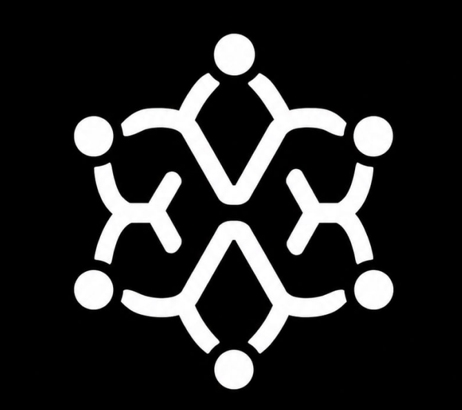
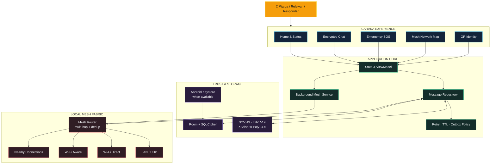
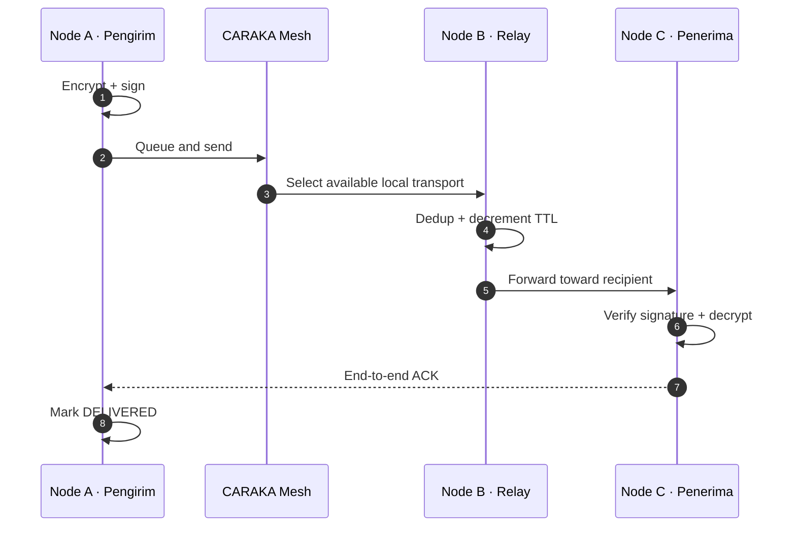

<p align="center">
  
</p>

<h1 align="center">CARAKA</h1>

<p align="center">
  <strong>Resilient offline communication for the moments that cannot wait.</strong><br>
  Komunikasi darurat antarperangkat ketika internet, BTS, dan layanan pusat tidak dapat diandalkan.
</p>

<p align="center">
  <em>"When The Grid Falls, We Rise."</em>
</p>

<p align="center">
  <a href="https://github.com/Fatihmaull/cakra-mesh">
    
  </a>
  
  
  
</p>

<p align="center">
  <a href="#-mengapa-caraka">Mengapa CARAKA</a> ·
  <a href="#-kemampuan-utama">Kemampuan</a> ·
  <a href="#-arsitektur-sistem">Arsitektur</a> ·
  <a href="#-mulai-cepat">Mulai Cepat</a> ·
  <a href="landing-page/index.html">Landing Page</a> ·
  <a href="docs/">Dokumentasi</a>
</p>

---

## 🛰️ Mengapa CARAKA?

**CARAKA** adalah aplikasi komunikasi mesh untuk Android yang membantu warga, relawan, dan tim tanggap darurat tetap bertukar informasi tanpa bergantung pada server pusat CARAKA. Perangkat di sekitar menjadi node yang dapat menemukan, menerima, dan meneruskan pesan melalui koneksi lokal.

CARAKA tidak dimaksudkan untuk menggantikan internet. Ia hadir sebagai **jalur komunikasi cadangan** ketika jaringan utama terganggu, terputus, atau tidak dapat dipercaya.

<table>
  <tr>
    <td width="25%" align="center"><strong>Tanpa Cloud</strong><br><sub>Tidak membutuhkan akun atau backend CARAKA</sub></td>
    <td width="25%" align="center"><strong>Multi-Transport</strong><br><sub>Memilih jalur lokal yang tersedia</sub></td>
    <td width="25%" align="center"><strong>Security by Design</strong><br><sub>Enkripsi, tanda tangan, dan database terlindungi</sub></td>
    <td width="25%" align="center"><strong>Emergency First</strong><br><sub>SOS prioritas tinggi untuk kondisi lapangan</sub></td>
  </tr>
</table>

### Konteks Indonesia

- [Laporan Kinerja Komdigi 2024](https://eppid.komdigi.go.id/attachments/89e781636daa0956d22d6969fdd3f75e8fa17343772a42ebba4dc57e61239a41/055c89fe9b532767a524481e9df16711c5071adb1c24c6cd024e30d5a08429f5.pdf) mencatat PDNS melayani **385 instansi pusat dan daerah**; laporan yang sama menyebut ransomware 2024 mengganggu sejumlah layanan publik.
- [InaRISK BNPB](https://inarisk.bnpb.go.id/about) menyediakan kajian risiko bencana melalui layanan data GIS, tetapi akses terhadap layanan digital tetap bergantung pada infrastruktur jaringan.
- CARAKA mengambil peran yang spesifik: menjaga komunikasi lokal tetap tersedia ketika kanal utama tidak dapat digunakan.

> Dibangun untuk **WRECK-IT 7.0** · *Cyber Warfare: Silent War on The Fifth Domain*

---

## 👥 Untuk Siapa?

| Persona | Kebutuhan di lapangan | Peran CARAKA |
|---|---|---|
| **BPBD, Polri, PMI** | Koordinasi saat infrastruktur terganggu | Chat langsung, identitas peran, alert, dan topologi node |
| **Relawan** | Menemukan tim dan menyampaikan kondisi | Discovery lokal, QR identity, chat, dan relay multi-hop |
| **Warga** | Meminta bantuan tanpa koneksi internet | SOS lokal, lokasi opsional, dan komunikasi dengan kontak sekitar |
| **Komunitas rawan bencana** | Menyiapkan kanal komunikasi cadangan | Mesh berbasis ponsel Android yang sudah dimiliki |

---

## ⚡ Kemampuan Utama

### Komunikasi yang tetap bergerak

- **Chat langsung terenkripsi** dengan kunci publik penerima yang telah dikenal.
- **Relay multi-hop berbasis TTL** untuk memperluas jangkauan melalui node perantara.
- **Empat jalur lokal**: LAN, Wi-Fi Direct, Wi-Fi Aware, dan Nearby Connections.
- **Outbox persisten** untuk menahan pesan ketika penerima belum terjangkau.
- **Retry terbatas dan ACK end-to-end** untuk status pengiriman yang lebih jujur.
- **Foreground service** untuk mempertahankan mesh di latar belakang selama diizinkan Android.

### Respons darurat

- **SOS broadcast** untuk Medis, Kebakaran, Keamanan, dan Bencana.
- **Hold-to-confirm dua detik** untuk mengurangi aktivasi tidak sengaja.
- **Prioritas EMERGENCY** dan hop budget lebih tinggi daripada chat biasa.
- **Lokasi opsional** ketika izin dan data lokasi tersedia.
- **Alert center** dengan penyaringan berdasarkan kategori.

### Trust dan identitas

- **QR identity** untuk menyimpan identitas dan kunci publik saat bertemu langsung.
- **Ed25519 signature** pada chat dan SOS untuk memverifikasi pengirim yang telah dikenal.
- **Role context** untuk BPBD, Polri, PMI, dan Civilian.
- **Community flagging** untuk menandai pesan yang dicurigai.
- **Dedup berbasis message ID** untuk mengurangi pemrosesan dan relay berulang.

### Pengalaman pengguna

- Home, Messages, Chat, Network, SOS, Alerts, Settings, Help, dan QR Identity.
- Bahasa Indonesia dan English dengan **271 string UI per bahasa**.
- Teks besar +25%, palet kontras tinggi, haptic feedback, dan onboarding tour.
- Status **ONLINE**, **HYBRID**, atau **MESH_ONLY** sesuai kondisi perangkat.
- Visualisasi node, koneksi, hop, dan statistik relay pada layar Network.

---

## 🕸️ Arsitektur Sistem

GitHub README tidak menjalankan JavaScript interaktif. Diagram berikut menggunakan **Mermaid**, yang dirender langsung oleh GitHub dan tetap terbaca sebagai source Markdown.



### Perjalanan sebuah pesan



---

## 🔐 Keamanan, Disederhanakan

| Lapisan | Implementasi | Manfaat |
|---|---|---|
| **Isi chat** | X25519 + XSalsa20-Poly1305 melalui NaCl `crypto_box` | Pesan langsung hanya dapat dibuka dengan kunci penerima |
| **Autentikasi pesan** | Ed25519 detached signature | Pesan dari kunci yang dikenal dapat diverifikasi |
| **Identitas kontak** | QR berisi fingerprint dan public keys | Pengguna dapat membangun trust saat bertemu langsung |
| **Penyimpanan lokal** | Room + SQLCipher | Data aplikasi tidak disimpan sebagai SQLite biasa |
| **Kunci database** | Passphrase acak, dibungkus Android Keystore bila tersedia | Mengurangi paparan material pembuka database |
| **Ketahanan relay** | TTL, message-ID dedup, outbox quota, bounded retry | Mengurangi loop, duplikasi, dan retry tanpa batas |

> **Catatan SOS:** payload SOS tidak dienkripsi end-to-end agar dapat dibaca oleh node mesh penerima. SOS tetap ditandatangani dengan Ed25519 ketika identitas pengirim tersedia.

CARAKA menggunakan pertahanan berlapis, bukan klaim keamanan absolut. Kunci identitas saat ini disimpan melalui Android DataStore, dan penyimpanan passphrase database memiliki fallback pada perangkat yang tidak dapat menggunakan Android Keystore.

---

## 🧰 Tech Stack

<p align="center">
  
  
  
  
  
  
  
  
  
</p>

| Area | Teknologi |
|---|---|
| **UI** | Jetpack Compose, Material 3, Navigation Compose |
| **State** | ViewModel, Kotlin Coroutines, StateFlow |
| **Data** | Room 2.6.1, SQLCipher 4.5.4, DataStore |
| **Crypto** | Lazysodium 5.1.0, X25519, Ed25519, XSalsa20-Poly1305 |
| **Transport** | LAN UDP, length-prefixed TCP, Wi-Fi Direct, Wi-Fi Aware, Nearby Connections |
| **Identity** | ZXing QR generation/scanning, Kotlin Serialization |
| **Dependency wiring** | Manual dependency injection melalui `CarakaApp` |

---

## 🚨 Skenario Nyata

| Situasi | Kanal utama | CARAKA |
|---|---|---|
| **Gempa merusak BTS** | Aplikasi internet kehilangan jalur | Perangkat sekitar membentuk komunikasi lokal |
| **Banjir memisahkan tim** | Informasi berhenti pada satu kelompok | Node perantara meneruskan pesan dengan TTL |
| **Layanan pusat terkena serangan** | Koordinasi bergantung pada sistem terdampak | Chat dan SOS berjalan tanpa backend CARAKA |
| **Evakuasi lintas organisasi** | Identitas digital sulit dicocokkan | QR membantu menyimpan identitas dan kunci publik |

---

## 🚀 Mulai Cepat

### Kebutuhan

- Android Studio dan Android SDK.
- JDK yang menyediakan `java` dan `javac`.
- Minimal dua ponsel Android fisik.
- Android 8.0 atau lebih baru (`minSdk 26`).

### Build

```powershell
git clone https://github.com/Fatihmaull/cakra-mesh.git
cd cakra-mesh/app
.\gradlew.bat assembleDebug
```

> Nama produk adalah **CARAKA**. `cakra-mesh` tetap muncul pada perintah di atas karena merupakan slug repositori GitHub saat ini.

APK debug:

```text
app/app/build/outputs/apk/debug/app-debug.apk
```

Build `assembleDebug` terakhir diverifikasi berhasil pada **13 Juni 2026** menggunakan JDK 21 dari Android Studio.

### Uji dua perangkat

1. Instal APK pada dua ponsel fisik.
2. Buat identitas lokal pada masing-masing perangkat.
3. Berikan izin nearby devices, lokasi, Bluetooth, dan notifikasi sesuai versi Android.
4. Buka layar **Network** dan tunggu node muncul.
5. Verifikasi kontak melalui QR, lalu kirim chat atau SOS.

---

## 📚 Dokumentasi

README ini berfungsi sebagai landing page publik. Detail engineering dipisahkan agar pembaca produk tidak harus melewati log migrasi atau matriks pengujian.

| Dokumen | Cakupan |
|---|---|
| [`docs/architecture/`](docs/architecture/) | Baseline, gap analysis, dan review arsitektur internal |
| [`docs/implementation/`](docs/implementation/) | Program implementasi dan rencana uji perangkat internal |
| [`docs/TECHNICAL_WRITEUP.md`](docs/TECHNICAL_WRITEUP.md) | Ringkasan teknis |
| [`docs/TEST_CHECKLIST.md`](docs/TEST_CHECKLIST.md) | Checklist pengujian mesh |
| [`docs/HCI_EVALUATION.md`](docs/HCI_EVALUATION.md) | Evaluasi usability dan aksesibilitas |

---

## 🤝 Kontribusi dan Lisensi

Kontribusi dapat diajukan melalui issue atau pull request pada [repositori CARAKA](https://github.com/Fatihmaull/cakra-mesh). Perubahan pada jaringan, kriptografi, database, atau lifecycle background sebaiknya disertai alasan desain dan langkah verifikasi pada perangkat fisik.

Repositori ini belum menyertakan file `LICENSE`. Hubungi pemilik repositori sebelum menyalin, mendistribusikan, atau menggunakan CARAKA di luar evaluasi proyek.

---

<p align="center">
  <br>
  <strong>CARAKA</strong><br>
  <sub>Resilient communication. Local trust. No central dependency.</sub><br><br>
  <em>"When The Grid Falls, We Rise."</em>
</p>
